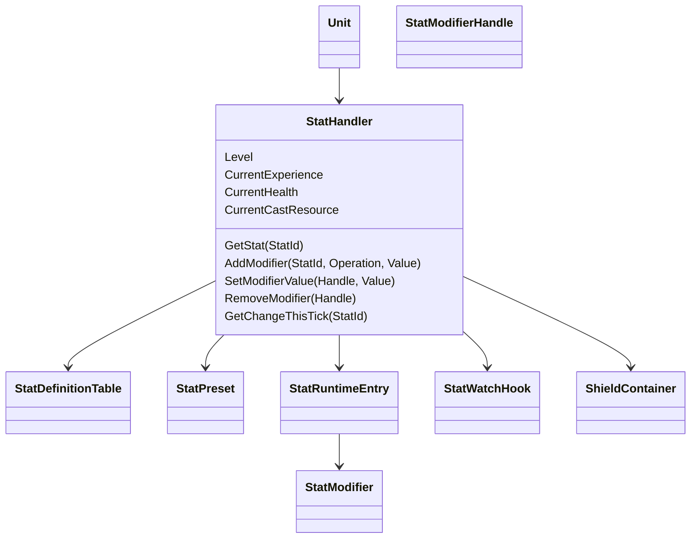

# 属性公式与 Modifier 所有权

## 目标实现

装备、Buff 与技能可修改属性且可精确释放自己的修改。

## 技术方案

StatHandler 采用正式 Base、Add、Ratio、Final 等槽位和锁定运算顺序；每个来源保有自己的 StatModifierHandle，StatSeq 提供稳定排序。

## 边界情况

死亡不全局清空所有 Modifier；静态配置不含运行 Handle；同值操作不意外改变稳定身份。

## 验收条件

- 正常路径达到上述目标，并由所属模块唯一拥有权威状态。
- 以上边界情况有明确返回、拒绝或可见失败；不得用占位成功代替行为。
- 确定性逻辑比较重复执行、改变插入顺序以及捕获/恢复/重演结果；只读界面不得改变 Gameplay。

## 工程实际核查

本期检索的是当前源码和测试定义。存在实现不等于完成全部需求，存在测试不等于本期已运行通过。

- `Assets/Scripts/Gameplay/Stats/StatDefinition.cs`：当前关联实现定义 StatDefinition（以源码为实际命名）。
- `Assets/Scripts/Gameplay/Stats/StatHandler.cs`：当前关联实现定义 StatHandler、StatConfig、ExperienceGainResult（以源码为实际命名）。
- `Assets/Scripts/Gameplay/Stats/StatModifier.cs`：当前关联实现定义 StatModifier（以源码为实际命名）。
- `Assets/Scripts/Gameplay/Stats/StatModifierHandle.cs`：当前关联实现定义 StatModifierHandle（以源码为实际命名）。

### 已有测试位置

- `Assets/Scripts/Gameplay/Tests/StatHandlerChangeTests.cs`：GetChangeThisTick_BeforeFinalize_NoChange、GetChangeThisTick_AfterModifierAdd_ReturnsDelta、GetChangeThisTick_NetChangeSameAsBaseline_ReturnsFalseZero、FinalizeTick_SnapshotsFinalValueAsPreviousBaseline、GetChangeThisTick_AfterFinalizeTick_ReturnsZero、GetChangeThisTick_StatNotInPreset_ReturnsDefault。
- `Assets/Scripts/Gameplay/Tests/StatHandlerModifierTests.cs`：AddModifier_ReturnsValidHandle_WithCorrectStatSeq、AddModifier_StatSeqMonotonicAcrossStatIds、AddModifier_InvalidStatId_Throws、SetModifierValue_UpdatesAndMarksDirty、SetModifierValue_WrongOwnerUid_ReturnsFalse、RemoveModifier_RemovesAndMarksDirty、RemoveModifier_AlreadyRemoved_ReturnsFalse。
- `Assets/Scripts/Gameplay/Tests/StatHandlerSeqTests.cs`：StatSeq_StartsAt1、StatSeq_NeverReusedAfterRemove、StatSeq_AcrossStatIds_SharedCounter、StatSeq_InvalidHandle_WhenStatSeqZero。
- `Assets/Scripts/Gameplay/Tests/StatHandlerSnapshotTests.cs`：CaptureRestore_RoundTrip_PreservesAllState、CaptureRestore_AfterModifications_ReturnsToCapturedState、AddModifier_AfterRestoreWithoutRuntimeStatEntry_RecreatesEntry、RollbackReplay_Equivalence、Restore_DoesNotTriggerDirtyRecompute_ValuesMatchSnapshot、Rebuild_MarksAllEntriesDirty、Determinism_SameSequence_SameSnapshot。
- `Assets/Scripts/Gameplay/Tests/StatHandlerCalculationTests.cs`：GetStat_NoModifiers_ReturnsLevelBaseValue、GetStat_FlatAdd_SumsCorrectly、GetStat_BaseRatioAdd_AppliesPercentToLevelBase、GetStat_FinalRatioAdd_AppliesPercentAfterFlatAndBase、GetStat_FixedOrder_FlatThenBaseThenFinal、GetStat_ClampByStatDefinition_MaxValue、GetStat_ClampByStatDefinition_MinValue。

## 附录：精确接口、公式与配置

附录保留本功能必须精确表达的接口、运算和配置语义，原系统章节已拆到所属功能。若与上面的已接受修订仍有冲突，进入待确认清单而不是按旧版本执行。

### 定位与整体结构

`StatHandler` 是单位长期属性、当前数值状态、等级成长、属性 Modifier、帧间变化查询和护盾实例的统一入口。

它负责：

| 内容 | 说明 |
|---|---|
| 属性定义接入 | 根据 `StatDefinitionTable` 识别每个 `StatId` 的边界和计算规则 |
| 单位基础配置 | 从 `UnitPrototype.BaseStats` 读取 `StatPreset` |
| 等级成长 | 根据当前等级计算等级基础值 |
| 属性 Modifier | 由 `StatHandler` 创建、编号、修改、移除并维护 Dirty |
| 最终值计算 | 按固定公式汇总同一属性下的 Modifier |
| 统一查询 | 通过 `GetStat(StatId)` 返回当前最终属性 |
| 帧间变化查询 | 通过只读 `WatchHook` 查询相较上一 LogicTick 的变化 |
| 当前状态值 | 保存生命、施法资源、等级和经验 |
| 护盾 | 管理不同类型的 `ShieldInstance` |
| 回滚 | 完整保存并恢复数值系统的逻辑状态 |

`StatHandler` 不负责：

```text
伤害、治疗、暴击、穿透和减伤公式。
技能、Buff、装备自身的运行状态。
判断某条 Modifier 的业务来源是否仍然有效。
下一次攻击必暴击、某次伤害减免等战斗公式修正。
金币和击杀经验奖励结算。
```

这些职责分别属于 `CombatSystem`、对应 Handler / Runtime 和 `CombatModifierSet`。



---

### 一项属性如何定义与配置

数值系统将“属性是什么”“某个单位的初始值是多少”“运行时最终值是多少”分成三层。

#### `StatId`：稳定属性身份

所有通用属性使用稳定的 `StatId`。

```csharp
public enum StatId : ushort
{
    MaxHealth,
    HealthRegeneration,

    MaxCastResource,
    CastResourceRegeneration,

    AttackDamage,
    AbilityPower,

    Armor,
    MagicResistance,

    AttackSpeed,
    AttackRange,
    MoveSpeed,
    CastRangeBonus,
    CooldownReduction,

    CriticalStrikeChance,
    CriticalStrikeDamage,

    ArmorPenetrationRatio,
    FlatArmorPenetration,
    MagicPenetrationRatio,
    FlatMagicPenetration,

    LifeSteal,
    Omnivamp,
    HealPower,
    ShieldPower,
    Tenacity,
}
```

当前生命、当前经验、当前施法资源和当前护盾不是 `StatId`：

```text
CurrentHealth
CurrentExperience
CurrentCastResource
CurrentShield
```

它们是会被实际消耗和恢复的运行时状态，不参与普通属性 Modifier 计算。

#### `StatDefinition`：全局定义

每个 `StatId` 在全局 `StatDefinitionTable` 中只有一条定义：

```csharp
[Serializable]
public sealed class StatDefinition
{
    public StatId Id;
    public string DebugName;

    public fp DefaultBaseValue;
    public bool SupportsLevelGrowth;

    public bool HasMinValue;
    public fp MinValue;

    public bool HasMaxValue;
    public fp MaxValue;
}
```

它负责描述：

```text
稳定 StatId。
Inspector 与调试名称。
单位未配置时的默认基础值。
是否允许等级成长。
最终值的统一下限和上限。
```

具体单位的基础值与成长值不放在 `StatDefinition` 中。

#### `StatPreset`：单位原型的基础与成长

`UnitPrototype.BaseStats` 的正式类型为：

```csharp
[Serializable]
public sealed class StatPreset
{
    public LevelExperienceConfig LevelExperience;
    public List<StatPresetEntry> Stats;
}
```

```csharp
[Serializable]
public struct StatPresetEntry
{
    public StatId StatId;

    // 1 级基础值。
    public fp BaseValue;

    // 等级成长值；不成长时填写 0。
    public fp GrowthValue;
}
```

这些值在 Inspector 中提前配置。`SpawnUnit` 只读取配置，不能临时传入基础值或成长值。

加载时验证：

```text
同一 StatPreset 内 StatId 不得重复。
StatId 必须存在于 StatDefinitionTable。
SupportsLevelGrowth == false 时 GrowthValue 必须为 0。
BaseValue 和 GrowthValue 必须使用确定性 fp。
所有必需属性必须存在，或有明确 DefaultBaseValue。
```

#### `StatRuntimeEntry`：运行时状态

每项属性拥有一个运行时条目：

```csharp
internal sealed class StatRuntimeEntry
{
    public fp LevelBaseValue;
    public fp FinalValue;

    // 上一个完整 LogicTick 结束时的最终值。
    public fp PreviousLogicTickFinalValue;

    public bool Dirty;

    // 当前属性下的 Modifier。
    public List<StatModifier> Modifiers;
}
```

`StatRuntimeEntry` 属于 `StatHandler` 的正式可快照状态。  
恢复时直接恢复它，不要求技能、Buff 或装备重新挂载 Modifier。

---

### 属性最终值如何计算

#### 等级基础值

设：

```text
L = max(Level - 1, 0)
```

等级成长公式：

```text
LevelGrowth
    = GrowthValue × L × (StatGrowthC + StatGrowthD × L)

LevelBaseValue
    = BaseValue + LevelGrowth
```

`StatGrowthC` 和 `StatGrowthD` 来自 `GlobalParamTable`。

#### `StatModifierOperation`

普通长期属性修正保留三种运算：

```csharp
public enum StatModifierOperation : byte
{
    FlatAdd,
    BaseRatioAdd,
    FinalRatioAdd,
}
```

| Operation | 说明 |
|---|---|
| `FlatAdd` | 在等级基础值之外增加固定数值 |
| `BaseRatioAdd` | 按等级基础值增加百分比 |
| `FinalRatioAdd` | 对前两步结果做最终百分比修正 |

百分比使用归一化小数：

```text
0.20 代表 +20%
-0.15 代表 -15%
```

普通属性系统不提供：

```text
Override
SetFinalValue
按优先级覆盖
任意公式回调
```

具体一次伤害、治疗、暴击或护盾公式的规则使用 `CombatModifierSet`。

#### 固定计算顺序

对某个 `StatId`：

```text
FlatSum
    = 该属性所有 FlatAdd 之和

BaseRatioSum
    = 该属性所有 BaseRatioAdd 之和

FinalRatioSum
    = 该属性所有 FinalRatioAdd 之和
```

最终值：

```text
BeforeFinalRatio
    = LevelBaseValue × (1 + BaseRatioSum)
      + FlatSum

UnclampedFinalValue
    = BeforeFinalRatio × (1 + FinalRatioSum)

FinalValue
    = ClampByStatDefinition(UnclampedFinalValue)
```

同组 Modifier 先求和，不按照添加顺序逐个连乘。  
`StatSeq` 只负责定位，不参与计算优先级。

#### 通用属性与消费者

| 属性 | 主要消费者 |
|---|---|
| `MaxHealth` | `StatHandler`、`CombatSystem`、UI |
| `HealthRegeneration` | 生命恢复流程 |
| `MaxCastResource` | `AbilityHandler`、资源恢复流程 |
| `CastResourceRegeneration` | 资源恢复流程 |
| `AttackDamage` | `AttackHandler`、`CombatSystem` |
| `AbilityPower` | 技能系统、`CombatSystem` |
| `Armor / MagicResistance` | `CombatSystem` |
| `AttackSpeed / AttackRange` | `AttackHandler`、`BehaviorPlanner` |
| `MoveSpeed` | `MovementHandler` |
| `CastRangeBonus / CooldownReduction` | `AbilityHandler` |
| 暴击、穿透、吸血、治疗和护盾属性 | `CombatSystem` |
| `Tenacity` | `CrowdControlHandler` |

消费者通过：

```csharp
public fp GetStat(StatId statId);
```

读取当前最终值，不直接改写内部缓存。

---

### Modifier、句柄与 StatSeq

#### 不再使用 `StatModifierSource`

v27.1 删除：

```text
StatModifierSource
StatModifierSourceKind
AttachSource
DetachSource
Source.Rebuild
```

数值系统只维护每项属性下的独立 Modifier。  
技能、Buff、装备或英雄 Runtime 自己保存所创建的 `StatModifierHandle`，并负责在正常业务生命周期中修改或移除。

一个来源需要提供多项属性时，来源 Runtime 保存多个句柄即可；数值系统不额外创建“来源容器”中间层。

#### `StatModifier`

Modifier 由 `StatHandler` 内部创建：

```csharp
internal struct StatModifier
{
    public uint StatSeq;
    public StatModifierOperation Operation;
    public fp Value;
}
```

Modifier 不重复保存 `StatId`，因为它已经存放在对应 `StatRuntimeEntry` 的集合中。

#### `ModifierId = StatId + StatSeq`

这里的：

```text
ModifierId = StatId + StatSeq
```

表示组合身份：

```text
(StatId, StatSeq)
```

不是普通整数加法，也不要求位打包成另一个字段。  
如果直接做算术相加，会出现：

```text
StatId = 1, StatSeq = 2
StatId = 2, StatSeq = 1
```

得到相同结果的问题。

因此不额外定义 `ModifierId` 类型，正式定位信息直接放在句柄中：

```csharp
public readonly struct StatModifierHandle
{
    public readonly UnitUid OwnerUnitUid;
    public readonly StatId StatId;
    public readonly uint StatSeq;
}
```

| 字段 | 作用 |
|---|---|
| `OwnerUnitUid` | 防止对象池旧句柄操作新生命周期单位 |
| `StatId` | 直接定位属性容器 |
| `StatSeq` | 定位该属性下的具体 Modifier |

#### StatSeq 分配规则

每个 `StatHandler` 维护一个统一序列：

```csharp
private uint _nextStatSeq = 1;
```

`0` 表示无效句柄。

规则：

```text
作用域：
    当前 UnitUid 对应的 StatHandler 运行时生命周期。

生成者：
    StatHandler。

分配：
    所有 StatId 共用同一个 _nextStatSeq。
    每次 AddModifier 单调递增。

删除：
    已分配 StatSeq 不回收、不复用。

英雄死亡和复活：
    UnitUid 不变，StatSeq 不重置。

对象池新生命周期：
    获得新 UnitUid 后，StatSeq 重置为 1。

回滚：
    _nextStatSeq 和所有 Modifier 的 StatSeq 直接快照和恢复。

溢出：
    产生确定性错误，禁止回绕。
```

虽然 `StatSeq` 在当前 `StatHandler` 内已经全局唯一，句柄仍保存 `StatId`，因为 Modifier 按属性分组存储，能避免额外维护 `StatSeq -> StatId` 索引。

#### 正式接口

```csharp
public sealed class StatHandler
{
    public StatModifierHandle AddModifier(
        StatId statId,
        StatModifierOperation operation,
        fp value);

    public bool SetModifierValue(
        StatModifierHandle handle,
        fp newValue);

    public bool RemoveModifier(
        StatModifierHandle handle);

    public bool TryGetModifier(
        StatModifierHandle handle,
        out StatModifierView view);

    public fp GetStat(
        StatId statId);

    public StatChange GetChangeThisTick(
        StatId statId);

    public void ClearModifiers();
}
```

只读查询结果：

```csharp
public readonly struct StatModifierView
{
    public readonly StatId StatId;
    public readonly uint StatSeq;
    public readonly StatModifierOperation Operation;
    public readonly fp Value;
}
```

不提供：

```text
GetMutableModifier
外部创建内部 StatModifier
外部指定 StatSeq
RemoveBySource
RemoveByValue
```

#### Add、修改与删除

`AddModifier`：

```text
验证 StatId。
验证 Operation。
分配 StatSeq。
由 StatHandler 创建内部 Modifier。
加入 StatId 对应容器。
标记该属性 Dirty。
返回 Handle。
```

```csharp
StatModifierHandle handle =
    Owner.StatHandler.AddModifier(
        StatId.Omnivamp,
        StatModifierOperation.FlatAdd,
        omnivampValue);
```

当技能等级、Buff 层数或装备状态改变时：

```csharp
Owner.StatHandler.SetModifierValue(
    handle,
    newValue);
```

`SetModifierValue` 必须：

```text
验证 OwnerUnitUid。
通过 StatId 找到属性容器。
通过 StatSeq 找到 Modifier。
只修改 Value。
值变化时标记对应属性 Dirty。
```

正常效果结束时：

```csharp
Owner.StatHandler.RemoveModifier(handle);
```

`RemoveModifier` 成功后标记对应属性 Dirty。  
调用方应将自己缓存的 Handle 置为 Invalid。

数值系统不实时检查：

```text
对应 Buff 是否还存在。
对应技能 Runtime 是否有效。
对应装备是否仍装备。
```

来源 Runtime 没有正确移除 Modifier 属于来源模块生命周期错误，不能由 `StatHandler` 自动扫描和修复。

---

### 完整快照、恢复与可定位性

#### StatHandler 是数值状态快照权威

数值快照包含：

```text
Level
CurrentExperience
CurrentHealth
CurrentCastResource

每项 StatRuntimeEntry：
    LevelBaseValue
    FinalValue
    PreviousLogicTickFinalValue
    Dirty
    全部 StatModifier：
        StatSeq
        Operation
        Value

_nextStatSeq

全部 ShieldInstance：
    ShieldInstanceId
    ShieldType
    CurrentValue
    MaxValue
    StartLogicTick
    ExpireLogicTick
    SourceToken
    CrowdControlImmunityHandle

护盾与其它数值运行时计数器
```

不进入快照：

```text
StatDefinitionTable
StatPreset
LevelExperienceConfig
其它只读静态配置
临时计算 Buffer
UI 关系
谁曾经查询 WatchHook
```

#### 回滚不走正常业务接口

`Restore` 直接整体替换内部状态，不调用：

```text
AddModifier
SetModifierValue
RemoveModifier
ClearModifiers
护盾正常添加或移除回调
属性变化事件
```

恢复不是在当前世界逐条删除再重新添加，而是把 `StatHandler` 直接替换成历史 LogicTick 的状态。

来源 Runtime 的快照同时保存自己持有的 `StatModifierHandle`。  
恢复后：

```text
Runtime.Handle:
    OwnerUnitUid + StatId + StatSeq

StatHandler:
    对应 StatId 下存在相同 StatSeq
```

二者自然重新对应，不需要重新挂载。

#### 不实时校验业务来源

`StatHandler` 不主动理解：

```text
这条 Modifier 来自哪个 Buff。
技能 Runtime 是否还存在。
装备是否仍穿戴。
```

正常业务由持有 Handle 的 Runtime 负责修改与移除。  
回滚由各系统恢复到同一历史 Tick。

开发环境可以提供一致性诊断，但不能自动删除或修复 Gameplay 状态。

#### CombatModifierSet 使用相同回滚原则

`CombatModifierSet` 的有效不可变 Record 和容器顺序也作为单位战斗状态直接快照。  
来源 Runtime 同时保存自己的 `CombatModifierHandle`。

恢复时不执行：

```text
Attach
Detach
Clear
RebuildCombatModifiers
```

正常 Gameplay 仍然只使用：

```text
Attach
Detach
Collect
Clear
```

#### 与 CombatModifierSet 的边界

| 效果 | 使用模块 |
|---|---|
| +50 攻击力 | `StatHandler.AddModifier` |
| 技能等级提供全能吸血 | `AddModifier + SetModifierValue` |
| Buff 层数改变护甲 | `SetModifierValue` |
| 装备按最大生命值换算攻击力 | 请求端查询 `MaxHealth` 帧间变化后，使用句柄更新攻击力 Modifier |
| 下一次普通攻击必定暴击 | `CombatModifierSet` |
| 受到某来源伤害降低 30% | `CombatModifierSet` |

```text
StatHandler
    维护持续单位属性。

CombatModifierSet
    维护具体战斗公式修正。
```

两者都可完整快照，但不能合并。


## 需求演进

### 2026-10-02

变动内容：正式死亡由 UnitWorld 同步执行，来源系统仅清理自己的句柄。

legacyDecision：D-009

### 2026-10-02

变动内容：作者 float 仅在 Bake/初始化边界转正式 fp，Tick 内不回转作为权威。

legacyDecision：D-022

