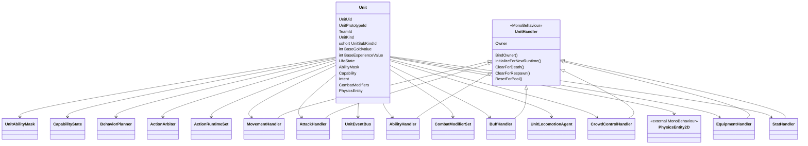

# 单位能力状态与战斗修正

## 本功能范围

本案细化“单位根与能力装配”中的单位能力状态与战斗修正，仅覆盖下列明确接口与边界。

## 目标实现

单位由明确类型、空间引用、属性与 Handler 能力组成。

## 技术方案

Unit 是唯一逻辑根，UnitKind、UnitSubKindId、UnitTag 和 CapabilityState 各有含义；Handler 能力决定可支持动作。

## 边界情况

不重复 UID 或空间状态；轻量隐形标记不是另一套可见性模拟；不能由表现组件装配顺序决定能力。

## 验收条件

- 正常路径达到上述目标，并由所属模块唯一拥有权威状态。
- 以上边界情况有明确返回、拒绝或可见失败；不得用占位成功代替行为。
- 确定性逻辑比较重复执行、改变插入顺序以及捕获/恢复/重演结果；只读界面不得改变 Gameplay。

## 工程实际核查

实现证据与已有测试位置关联总案；字段存在不能认定行为已验收。

### 默认动作能力由 Handler 决定

v27.1 继续明确：默认动作能力不是独立手填的单位类型字段，而是由是否装配对应 Handler 推导。

```csharp
public readonly struct UnitAbilityMask
{
    public readonly bool HasMovement;
    public readonly bool HasAttack;
    public readonly bool HasAbility;
}
```

推导规则：

```csharp
public static UnitAbilityMask BuildAbilityMask(HandlerLoadout loadout)
{
    return new UnitAbilityMask(
        hasMovement: loadout.MovementHandler != null,
        hasAttack: loadout.AttackHandler != null,
        hasAbility: loadout.AbilityHandler != null
    );
}
```

常见配置：

| 单位 | UnitKind / UnitSubKind | MovementHandler | AttackHandler | AbilityHandler |
|---|---|---:|---:|---:|
| 英雄 | Hero / NormalHero | 有 | 有 | 有 |
| 小兵 | Minion / 按兵种配置 | 有 | 有 | 无 |
| 普通野怪 | Monster / NormalMonster | 有 | 有 | 无 |
| 史诗野怪 | Monster / EpicMonster | 有 | 有 | 按配置 |
| 防御塔 | Structure / Tower | 无 | 有 | 无 |
| TowerRuin | Structure / TowerRuin | 无 | 无 | 无 |

不纳入 `UnitAbilityMask`：

```text
Buff
Control
Equipment
Targetable
PhysicsEntity2D
Locomotion
```

这些不是主动动作能力，而是状态、表现、空间或外部执行能力。

### LifeState

```csharp
public enum LifeState : byte
{
    Alive,
    Dying,
    Dead,
    Respawning
}
```

| 状态 | 说明 |
|---|---|
| `Alive` | 正常参与单位行为和战斗模拟 |
| `Dying` | 已触发致死条件，正在当前 Combat Settlement Cycle 中进行死亡阻止与正式死亡判定 |
| `Dead` | `UnitWorld` 已接受正式死亡判决并同步写入逻辑死亡 |
| `Respawning` | `UnitWorld` 已开始正常复活初始化，但单位尚未恢复主动行为 |

`Unit` 保存 `LifeState`，但不公开任意写入口：

```csharp
public LifeState LifeState { get; private set; }

internal void ApplyLifeStateFromUnitWorld(
    LifeState newState)
{
    LifeState = newState;
}
```

权威边界：

```text
Unit
    保存 LifeState。

UnitWorld
    唯一正式写入 LifeState。
    校验状态转换。
    管理死亡表现、正常复活、回池、销毁和废墟生成。

CombatSystem
    判定致死、死亡阻止和正式死亡结果。
    在当前 Combat Settlement Cycle 内同步请求 UnitWorld
    写入 Dying / Alive / Dead。
    不直接写 Unit.LifeState。

其它系统
    可以通过 UnitWorld 的正式接口请求生命周期变化。
    不能绕过 UnitWorld 修改状态。
```

完整状态转换：

```text
Alive
    ↓ CombatSystem 同步请求进入死亡判定
Dying
    ├── 死亡被阻止
    │       ↓ UnitWorld 在当前 Combat 循环内同步应用
    │     Alive
    │
    └── CombatSystem 提交正式死亡判决
            ↓ UnitWorld 在当前 Combat 循环内同步应用
          Dead
            ↓ UnitWorld 的正常复活等待完成
       Respawning
            ↓ UnitWorld 完成复活初始化
          Alive
```

`Dying` 与 `Dead` 不能被排入 Combat 阶段结束后的生命周期队列。  
`UnitDying`、`UnitDeath` 和 `UnitKill` Reaction 产生的新 CombatRequest 可以继续进入当前 Tick 的 Combat Settlement Cycle。

Combat 阶段之后，`UnitWorld` 的跨 Tick 生命周期队列只处理：

```text
死亡动画等待
对象池回收
Destroy
TowerRuin 生成
Dead -> Respawning
Respawning -> Alive
其它明确的跨 Tick 生命周期节点
```

`Dying` 不表示正在播放死亡动画，也不等于已经死亡。  
只有 `UnitWorld` 将状态写为 `Dead` 后，才会发布 `UnitDeath`、执行死亡回调、清理来源自身不应跨死亡保留的状态并播放死亡动画。

`Respawning` 只用于保留同一运行时对象和同一 `UnitUid` 的复活流程，例如英雄。  
对象池中的小兵、普通野怪和召唤物再次出现时属于新的生成，获得新的 `UnitUid`，通常不经过 `Respawning`。

逻辑死亡与权威比赛记录仍然不同：

```text
LifeState.Dead
    表示当前确定性模拟中已经逻辑死亡。

权威 Tick 确认后的击杀记录
    属于战斗系统与比赛流程总控。
```

死亡动画结束不是 `UnitEventBus` 事件。  
动画结束后的对象保留、回收、销毁和废墟生成属于 `UnitWorld` 内部生命周期管理。

> **帧同步设计关注点**  


### CapabilityState

`CapabilityState` 是单位行为层的粗粒度能力状态，只回答单位当前能否主动发起基础行为：

| 字段 | 说明 |
|---|---|
| `CanMove` | 当前是否允许主动移动 |
| `CanAttack` | 当前是否允许主动普攻 |
| `CanCast` | 当前是否允许主动施法 |
| `CanTurn` | 当前是否允许主动转向 |
| `IsTargetable` | 当前是否可被选中或命中 |

它不回答：

```text
能否被击退
能否被拉取
能否被击飞
能否被强制改变位置
当前具体受到了哪种控制
不可阻挡为什么允许某个动作继续
```

`CapabilityState` 由单位已有能力、生命状态和控制系统最终汇总结果共同刷新，但不会复制一套细粒度控制 Mask：

```text
Handler 装配
LifeState
CrowdControlStateView
其它单位级规则
    ↓
Unit.RefreshCapabilityState()
```

例如：

```text
单位存在 MovementHandler
    -> HasMovement = true

CrowdControlStateView 禁止主动移动
    -> CanMove = false
```

这里必须明确：

```text
主动移动 != 强制位移
```

因此：

```csharp
Capability.CanMove = false;
```

只阻止单位通过 `BehaviorPlanner -> ActionArbiter -> MoveActionRuntime` 发起主动移动，不会阻止击退、拉取、击飞位移等强制位移。强制位移不播放普通移动动画，也不经过普通移动 Action。

`ActionArbiter` 在判断新行为和当前 Runtime 时，可以直接读取：

```text
unit.CapabilityState
unit.CrowdControlHandler.State
```

不需要再增加：

```text
OnCrowdControlStateChanged(previous, current)
UnitActionRestrictionState
单位框架自己的不可阻挡 Mask
```

控制系统内部如何处理不可阻挡、控制优先级和最终 Block 结果，不属于单位框架。

`Dying` 不应简单等同于：

```text
DisableAllActions
IsTargetable = false
```

因为 `Dying` 表示 `UnitWorld` 已接受“进入死亡判定”的请求，而 `CombatSystem` 仍在处理本次死亡结算，所以它可能恢复为 `Alive`。推荐让该阶段在当前战斗结算流程内完成，不让普通 `BehaviorPlanner` 和 `ActionRuntime` 在此临时状态下额外推进一次。

只有 `UnitWorld` 正式写入 `Dead` 后，才由 `UnitWorld` 统一组织：

```text
Capability.DisableAllActions()
Capability.IsTargetable = false
Intent.Clear()
ActionRuntimeSet.CancelAll()
CrowdControlHandler.ClearForDeath()
```

进入 `Respawning` 后仍保持：

```text
CanMove = false
CanAttack = false
CanCast = false
CanTurn = false
IsTargetable = false
```

并再次执行幂等的控制清理。复活位置、生命资源、空间状态和必要表现初始化完成后，才切换为：

```text
LifeState = Alive
Capability.ResetAliveDefault(AbilityMask)
```

英雄等待复活时：

```text
LifeState = Dead
IsTargetable = false
UnitObject 保持在原地
表现层停在死亡动画最后一帧
PhysicsEntity2D 保持死亡位置，但查询规则不再把它作为正常战斗目标
```

> **帧同步设计关注点**  


### CombatModifierSet：战斗公式修正挂载入口

`CombatModifierSet` 是 `Unit` 当前有效战斗公式修正的统一容器。

```csharp
public CombatModifierSet CombatModifiers
{
    get;
    private set;
}
```

单位完成基础绑定时创建一次：

```csharp
CombatModifiers =
    new CombatModifierSet(this);
```

对象池复用时不重新创建容器，只执行生命周期清理。  
容器不能缓存旧的 `UnitUid`；校验 Handle 时应读取 Owner 当前的权威 `UnitUid`。

它负责：

```text
保存当前 Unit 上已经生效的不可变 CombatModifierRecord。
校验同一 Unit 内的 ModifierId 唯一性。
向挂载端返回只属于本次挂载的 CombatModifierHandle。
根据 CombatModifierQuery 为 CombatSystem 收集匹配候选。
在来源 Runtime 正常结束时按 Handle 精确清理；仅在非死亡 Despawn、回池、新运行时初始化或永久销毁等完整终止场景中全量清理。回滚恢复时直接替换历史状态。
```

它不负责：

```text
计算伤害、治疗或护盾。
判断 Buff、技能、装备是否仍然有效。
保存层数、持续时间、剩余次数、充能或冷却。
Tick Modifier。
替代 StatHandler。
理解或校验来源 Runtime 的业务状态。
```

正式接口冻结为：

```csharp
public sealed class CombatModifierSet
{
    public CombatModifierHandle Attach(
        CombatModifierRecord record);

    public bool Detach(
        CombatModifierHandle handle);

    public void Collect(
        in CombatModifierQuery query,
        CombatModifierBuffer output);

    public void Clear();
}
```

本版**不提供 `Update`**。

#### 不可变 Record

`CombatModifierRecord` 在提交给 `Attach` 后必须保持完全不可变，包括其内部 Patch 集合。

```text
Attach 之后：
    不允许改 Id。
    不允许改 Match。
    不允许改 FormulaPatch。
    不允许改 PolicyPatch。
    不允许修改 Record 内部数组或集合。
```

来源 Runtime 的可变状态不能塞进 Record：

```text
Buff 层数。
技能蓄力进度。
装备充能。
剩余触发次数。
持续时间。
冷却。
```

这些状态继续由来源 Runtime 权威保存。

动态战斗效果按以下方式表达：

```text
效果开始或某个稳定生效点成立
    -> Attach 一条不可变 Record。

效果结束或该稳定生效点失效
    -> 使用自己缓存的 Handle Detach。

随当前属性自然变化的数值
    -> 由 CombatOperand 在正式结算时读取
       SourceStat / TargetStat。

多层效果
    -> 每层使用独立稳定生效点，
       或由来源 Runtime 按离散状态挂载 / 移除不同 Record。

无法通过稳定挂载或当前 Stat 表达的动态量
    -> 留在来源技能、Buff、装备或 CombatRequest / Recipe 中，
       不通过修改已挂载 Record 实现。
```

禁止：

```text
为了层数变化替换同一条 Record。
为了蓄力进度持续重写 Modifier。
把 CombatModifierSet 当作可变 Gameplay 状态数据库。
通过 Detach 后用相同 Id 立即 Attach 来伪装 Update。
```

如果公式身份或生效点发生了真实变化，应结束旧挂载，并在新生效点创建时根据当前 `LogicTick` 与新的稳定字符串生成新的确定性 ID。

#### Handle 与 Record

```csharp
public readonly struct CombatModifierHandle
{
    public readonly UnitUid OwnerUnitUid;
    public readonly ulong ModifierId;
}
```

边界：

```text
CombatModifierRecord
    只保存创建处根据当前 LogicTick 与稳定字符串生成的确定性 Id。
    不保存 Handle。

CombatModifierHandle
    只由 Attach 返回。
    只由创建该挂载的 Runtime 持有。
    不作为 CombatSystem 的公式数据。
```

挂载端：

```csharp
_modifierHandle =
    Owner.CombatModifiers.Attach(record);
```

结束时：

```csharp
Owner.CombatModifiers.Detach(
    _modifierHandle);

_modifierHandle = default;
```

`Detach` 必须校验：

```text
Handle.OwnerUnitUid 与当前 Owner.UnitUid 一致。
Handle.ModifierId 当前仍然存在。
```

正常业务不提供 `RemoveById`。  
来源 Runtime 只能使用自己缓存的 Handle 结束自己的挂载。

#### 确定性 ID

`CombatModifierRecord.Id` 由 **创建处** 在调用 `Attach` 前生成。

ID 由两部分组成：

```text
CombatModifierRecord.Id
├── CreationLogicTick
└── ModifierKeyHash
```

其中：

| 部分 | 说明 |
|---|---|
| `CreationLogicTick` | 创建该 Modifier 时的 `SimulationTickContext.Current.Tick` |
| `ModifierKeyHash` | 调用处传入字符串经过项目统一确定性算法得到的哈希值 |

推荐使用一个 `ulong` 保存组合结果：

```text
高 32 位：CreationLogicTick
低 32 位：ModifierKeyHash
```

概念接口：

```csharp
int currentLogicTick =
    SimulationTickContext.Current.Tick;

record.Id =
    CombatModifierId.Create(
        currentLogicTick,
        modifierKey);
```

等价的概念组合：

```csharp
ulong modifierId =
    ((ulong)(uint)currentLogicTick << 32)
    | DeterministicHash32.Utf8(modifierKey);
```

具体位运算和哈希算法由公共确定性工具冻结；Gameplay 调用处不自行实现另一套算法。

`modifierKey` 由创建处传入，通常使用技能、Buff 或装备效果的稳定名称，例如：

```text
Ability.AatroxE.PassiveOmnivamp
Buff.Berserk.DamageReduction
Equipment.InfinityEdge.ForceCrit
```

字符串必须是代码或静态配置中的稳定键，不得使用本地化显示名称。

当同一个效果在同一 `LogicTick` 内最多只创建一条 Record 时，效果名称本身即可作为 `modifierKey`。

当同一 Tick 内可能创建多个同名 Modifier 时，创建处必须加入确定性的区分后缀，例如：

```text
Buff.Berserk/{BuffInstanceSeq}/DamageReduction
Ability.MultiCast/{AbilityRuntimeSeq}/EmpoweredDamage
Equipment.Aura/{EmitterUnitUid}/AttackBonus
```

该后缀必须来自可回滚、可复现的 Gameplay 身份或序号，不能使用随机数、对象地址或 Unity 实例编号。

因此，同一 Unit 当前生命周期中的 ID 规则是：

```text
ModifierId =
    CreationLogicTick
    +
    Hash32(modifierKey)
```

这里的 `+` 表示组合，不是普通算术相加。

禁止：

```text
string.GetHashCode
HashCode.Combine
object.GetHashCode
Unity InstanceId
对象引用地址
随机数
依赖系统区域文化的 ToString
本地化显示名称
```

同一个 `CombatModifierSet` 中出现重复 ID：

```text
Attach
    -> 确定性错误。
```

哈希碰撞或同 Tick 同 Key 冲突都不能静默覆盖。

回滚后再次模拟到同一个创建 Tick，并由同一调用处传入同一个稳定字符串时，必须生成完全相同的 `CombatModifierRecord.Id`。

#### Collect

`Collect` 是 `CombatSystem` 的只读查询入口：

```text
CombatSystem 构造 CombatModifierQuery
    ↓
SourceUnit.CombatModifiers.Collect(...)
    ↓
TargetUnit.CombatModifiers.Collect(...)
    ↓
CombatSystem 使用 CombatModifierBuffer 计算固定公式
```

`Collect`：

```text
只读取当前已挂载 Record。
只输出与 Query 匹配的候选。
不执行战斗公式。
不修改容器。
不结束任何来源效果。
```

查询期间禁止 `Attach / Detach / Clear`。  
输出顺序必须确定，建议按 `ModifierId` 升序写入 `CombatModifierBuffer`。

> **帧同步设计关注点**  
> `CombatModifierSet` 当前有效的不可变 Record、确定性容器顺序和来源 Runtime 持有的 Handle 均作为正式回滚状态保存。  
> `Restore` 直接恢复历史集合，不重新调用 `Attach / Detach / Clear`，也不触发来源效果。

---

### Unit 类图



`UnitEventBus` 是 `Unit` 的固定路由服务，不是 `UnitHandler`，也不参与动态订阅。  
`CombatModifierSet` 是普通 C# 查询容器，同样不是 `UnitHandler`。


---


## 需求演进

### 2026-10-02

变动内容：生成 Tick 可被动参与，主动工作晚于出生 Tick。

legacyDecision：D-008

