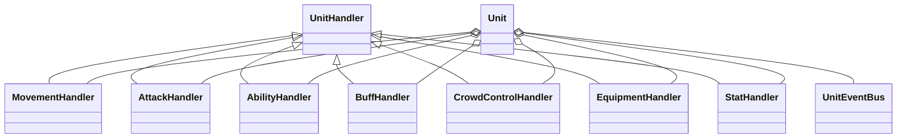
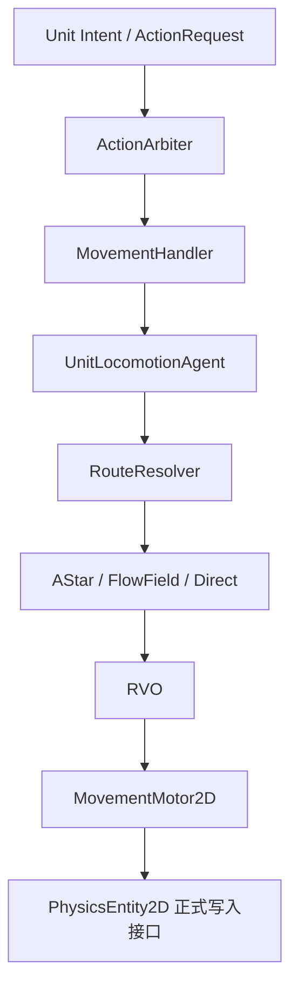

# Handler装配与单向依赖

## 本功能范围

本案细化“单位根与能力装配”中的Handler装配与单向依赖，仅覆盖下列明确接口与边界。

## 目标实现

单位由明确类型、空间引用、属性与 Handler 能力组成。

## 技术方案

Unit 是唯一逻辑根，UnitKind、UnitSubKindId、UnitTag 和 CapabilityState 各有含义；Handler 能力决定可支持动作。

## 边界情况

不重复 UID 或空间状态；轻量隐形标记不是另一套可见性模拟；不能由表现组件装配顺序决定能力。

## 验收条件

- 正常路径达到上述目标，并由所属模块唯一拥有权威状态。
- 以上边界情况有明确返回、拒绝或可见失败；不得用占位成功代替行为。
- 确定性逻辑比较重复执行、改变插入顺序以及捕获/恢复/重演结果；只读界面不得改变 Gameplay。

## 工程实际核查

实现证据与已有测试位置关联总案；字段存在不能认定行为已验收。

### Handler 总体结构

所有 Handler 使用统一父类，但父类只提供共同基础设施：

```csharp
public abstract class UnitHandler : MonoBehaviour
{
    public Unit Owner { get; private set; }

    internal void BindOwner(Unit owner)
    {
        Owner = owner;
        OnOwnerBound();
    }

    protected virtual void OnOwnerBound()
    {
    }

    public virtual void InitializeForNewRuntime()
    {
    }

    public virtual void ClearForDeath()
    {
    }

    public virtual void ClearForRespawn()
    {
    }

    public virtual void ClearForDespawn(
        UnitDespawnReason reason)
    {
    }

    public virtual void ResetForPool()
    {
    }
}
```

公共父类适合承载：

```text
Owner 引用。
新运行时初始化。
死亡后清理。
复活初始化清理。
非死亡规则移除前的来源清理。
对象池重置。
公共调试和校验接缝。
```

公共父类不包含全部 Gameplay 事件的虚方法。  
否则每增加一个事件都必须修改所有 Handler 的共同基类，并让大量无关 Handler 继承无意义方法。

`ClearForDespawn` 只用于当前 `UnitUid` 生命周期被非死亡规则正式终止时，让 Handler 结束自己拥有的 Runtime、句柄和外部关系。它不发布 `UnitDeath`，也不能提交死亡奖励或死亡 Reaction。  
`ResetForPool` 是静默重置接口，不得发布 `UnitEventBus` 事件、提交 Gameplay Request 或依赖当前帧业务规则；因此它也可以被回滚拓扑清理用于移除快照中不存在的多余运行时对象。

v27.1 也不采用“一事件一个接口”。  
当前 Handler 集合稳定，`UnitEventBus` 直接知道哪些具体 Handler 提供哪些强类型回调，代码更直接、更容易审查。



Handler 是 `Unit` 内部的能力或状态模块。  
`UnitEventBus` 是固定路由服务，不继承 `UnitHandler`。

> **帧同步设计关注点**  
> 某个 Handler 如果持有会影响后续 LogicTick 的可变运行状态，应由帧同步设计师判断其保存和恢复方式。无状态 Handler 不需要为了结构对称而强制设计空快照。

### Handler 分类

| Handler | 是否由 `UnitAbilityMask` 控制 | 说明 |
|---|---|---|
| `MovementHandler` | 是 | 主动移动、Dash 与强制位移的单位侧执行入口 |
| `AttackHandler` | 是 | 普攻能力入口，对齐攻击模块 v4 |
| `AbilityHandler` | 是 | 技能系统总入口，持有当前 `AbilitySession` 接入状态并提供只读查询 |
| `BuffHandler` | 否 | Buff 管理、查询和 Reaction 入口 |
| `CrowdControlHandler` | 否 | 控制实例、汇总状态与强制行为胜者的唯一运行时入口 |
| `EquipmentHandler` | 否 | 装备管理与 Reaction 入口 |
| `StatHandler` | 否 | 通用数值容器 |
| `UnitEventBus` | 不适用 | Unit 固定持有的强类型事件路由服务，不是 Handler |
| `CombatModifierSet` | 不适用 | Unit 固定持有的战斗公式修正挂载与查询容器，不是 Handler |

不是每个 Handler 都对应一个具体行为。Buff、控制、装备和数值系统不放进 `UnitAbilityMask`。

`AbilityHandler` 的边界：

```text
AbilityActionRuntime
    只管理 Action 层外壳和 Reservation。

AbilityHandler
    接收 AbilitySignal。
    持有和推进 AbilitySession。
    将 AbilitySessionOutcome 回传给行为层。
    提供 TryGetCurrentCast() 只读查询。
    在技能配置要求时发布 AbilityCast。

AbilitySession / CastModelDef / StageDef
    管理技能 Stage、阶段计时和具体技能流程。
```

`CrowdControlHandler` 的边界：

```text
管理控制实例、免疫和内部规则。
汇总 CrowdControlStateView。
稳定选择 CrowdControlBehaviorOverride。
内部处理不可阻挡和 CrowdControl Signal。
必要时直接调用 MovementHandler 的强制位移入口。
```

单位框架不增加控制状态回调层、不可阻挡模型或 Signal 转发层。

### Handler 交互原则

推荐交互路径：

| 场景 | 推荐路径 |
|---|---|
| 技能启动 Dash | `AbilityHandler -> DashRequest -> ActionArbiter -> MovementHandler` |
| 恐惧、魅惑、嘲讽 | `CrowdControlBehaviorOverride -> BehaviorPlanner -> Move/AttackActionRequest -> ActionArbiter -> Handler` |
| 控制产生击退 | `CrowdControlHandler -> MovementHandler.StartForcedDisplacement` |
| 普攻提交 Gameplay 输出 | `AttackActionRuntime -> AttackHandler.CommitAttack()` |
| 普攻产生伤害 | `AttackHandler / Projectile -> DamageRequest -> CombatSystem -> StatHandler` |
| 技能加护盾 | `AbilityHandler -> ShieldRequest -> CombatSystem -> StatHandler` |
| 黑盾建立或解除控制免疫 | `StatHandler -> CrowdControlHandler.AddImmunity / RemoveImmunity` |
| Buff 修改属性 | `BuffHandler -> StatHandler.AddModifier / SetModifierValue / RemoveModifier` |
| 技能、Buff、装备建立战斗公式修正 | `AbilityHandler / BuffHandler / EquipmentHandler -> Unit.CombatModifiers.Attach` |
| 生效点结束战斗公式修正 | `来源 Runtime -> Unit.CombatModifiers.Detach(handle)` |
| 战斗系统查询公式修正 | `CombatSystem -> Source/Target Unit.CombatModifiers.Collect` |
| 外部查询当前施法 | `Unit -> AbilityHandler.TryGetCurrentCast()` |
| 技能会话结束 | `AbilitySessionOutcome -> AbilityHandler -> AbilityActionRuntime` |
| Gameplay 结果回调 | `Result Producer -> UnitEventBus.Publish(SpecificEvent) -> 具体 Handler 回调` |

Handler 之间不通过任意改写对方内部状态完成协作。

需要产生普通行为时提交 `ActionRequest`；需要产生战斗结果时提交对应系统请求；需要读取持续状态时使用公开只读接口。

允许的直接执行接缝必须数量有限、语义明确：

```text
CrowdControlHandler
    -> MovementHandler.StartForcedDisplacement

StatHandler
    -> CrowdControlHandler.AddImmunity / RemoveImmunity
       仅用于黑盾的控制免疫生命周期绑定

UnitEventBus
    -> 固定顺序直接调用已知 Handler 的强类型事件回调

AbilityHandler / BuffHandler / EquipmentHandler
    -> CombatModifierSet.Attach / Detach

CombatSystem
    -> CombatModifierSet.Collect
```

`UnitEventBus` 的直接调用不是任意 Handler 互调，而是单位框架冻结的事件路由职责。  
其它 Handler 可以通过所属 `Unit` 直接访问 `unit.StatHandler`、`unit.CrowdControlHandler.State` 和 `unit.CombatModifiers`，不新增中间适配层。  
`CombatModifierSet` 只允许 Ability、Buff、Equipment 等明确生效点挂载和移除自己的 Record；`CombatSystem` 只读查询。

### 三层边界

```text
Unit:
    行为、战斗、身份和生命周期语义根对象。
    持有 PhysicsEntity2D 引用，但不直接实现空间模拟。

MovementHandler:
    Unit Handler 架构中的移动能力入口。
    接收移动类请求，参与能力与占用判断，桥接到 Locomotion。

UnitLocomotionAgent:
    移动执行侧代理。
    负责移动任务、路径状态、RVO 接入、速度推进和移动结果写入。
    它不再自己拥有位置、朝向、形状和 Bounds。
    最终空间结果通过 `PhysicsEntity2D.ApplyLogicPositionDelta / SetLogicPose / TeleportLogicPosition` 等物理系统正式接口写入。
```



`PhysicsEntity2D` 在本专题中只作为写入目标出现。  
空间网格、碰撞求解、Sweep、AABB 更新等属于物理模拟系统，不在单位框架展开。


## 需求演进

### 2026-10-02

变动内容：生成 Tick 可被动参与，主动工作晚于出生 Tick。

legacyDecision：D-008

