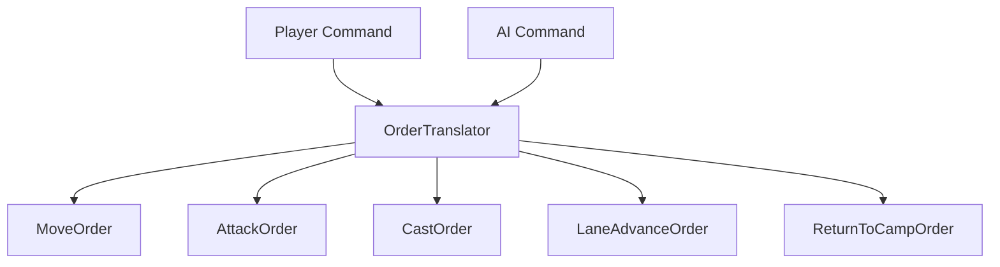

# 意图规划与输入 Order

## 目标实现

玩家命令和 AI 意图通过统一规划链产生类型化动作申请。

## 技术方案

Command 先翻译为 Order，BehaviorPlanner 读取 Intent 与 Handler 只读状态产生 ActionRequest；Order 不保存寻路策略。

## 边界情况

AI 不模拟物理按键或生成玩家网络命令；Planner 不能直接推进技能/攻击 Runtime。

## 验收条件

- 正常路径达到上述目标，并由所属模块唯一拥有权威状态。
- 以上边界情况有明确返回、拒绝或可见失败；不得用占位成功代替行为。
- 确定性逻辑比较重复执行、改变插入顺序以及捕获/恢复/重演结果；只读界面不得改变 Gameplay。

## 工程实际核查

本期检索的是当前源码和测试定义。存在实现不等于完成全部需求，存在测试不等于本期已运行通过。

- `Assets/Scripts/Gameplay/Unit/Core/BehaviorPlanner.cs`：当前关联实现定义 BehaviorPlanner（以源码为实际命名）。
- `Assets/Scripts/Gameplay/Unit/Core/OrderTranslator.cs`：当前关联实现定义 OrderTranslator（以源码为实际命名）。
- `Assets/Scripts/Gameplay/Unit/Core/UnitIntent.cs`：当前关联实现定义 IntentKind、UnitIntent（以源码为实际命名）。

### 已有测试位置

- `Assets/Scripts/FrameSync/Tests/LocalCommandGoldMatchFlowTests.cs`：FutureCommand_IsRetainedAndConsumedOnlyAtTargetTick、CastIntentAndAction_PreserveCommitVerbAndDirectionAim、PlanCastIntent_UsesAbilityCastRange_NotHardcoded、NaturalGold_IsTickDerivedCanonicalAndInsideOpenBatch、ClientPredictionCannotEnterEnding_ButServerAuthorityCan。
- `Assets/Scripts/FrameSync/Tests/SnapshotChecksumCompletenessTests.cs`：AggregateSnapshot_RestoresIntentDashAndLocomotion、SharedChecksum_ChangesForIntentDashAndLocomotionState、CombatModifierCapture_IsCanonicalAndDetachRepairsShiftedIndices、AggregateSnapshot_CapturesLiveActionRuntime、ExecuteTick_FormalDeathInvalidationCapturesRestorableBoundary、SharedChecksum_SerializesEveryActionRuntimeSlotMember、Restore_RejectsActionRuntimeWithoutOwningHandlerState。
- `Assets/Scripts/Gameplay/Tests/ActionArbiterConcurrencyTests.cs`：LockedMainCast_AllowsAuthoredDashInBaseSlot、MovableHold_AllowsMove_ReleasePreemptsMove、HoldTimeout_ReconcilesReleaseResourcesAndRestores、SameAbilityStageTransition_MigratesMainToBaseSlot、AutomaticDashTransition_MigratesWithoutCancellingSession、SequentialRecastWindow_ReleasesMainRuntimeButKeepsSession、Planner_DoesNotResubmitEquivalentActiveMove。
- `Assets/Scripts/Gameplay/Tests/IntegratedPathfindingPipelineTests.cs`：LaneAdvance_SelectsTeamFlowField、Chase_FirstTickBuildsPathBeforeRepathCooldown、Chase_DoesNotCompleteWhileOutsideAttackRange_AtPathDestinationCell、ChaseForCast_DoesNotCompleteAtAttackBoundaryDistance、PointMove_UsesDirectOrAStarByGrid、FlowFieldRvoMovement_ProducesRepeatableMotion、RadiusAwareLineOfSight_BlocksLargeUnit。
- `Assets/Scripts/Gameplay/Tests/MinionThreatSystemTests.cs`：Acquisition_SetsInitialThreat_AndPicksClosestUnclaimed、DamageTaken_AddsThreat_InverselyProportionalToDistance、HigherThreatTarget_SwitchesOnlyWhenNotInWindup、Acquisition_PairsAlliesWithDistinctTargets、ThreatTable_SnapshotRoundTrip_PreservesEntries、SnapshotRoundTrip_PreservesLastThreatRefreshTick、RestoreReplacement_UnsubscribesPreviousController。

## 附录：精确接口、公式与配置

附录保留本功能必须精确表达的接口、运算和配置语义，原系统章节已拆到所属功能。若与上面的已接受修订仍有冲突，进入待确认清单而不是按旧版本执行。

### Command 与 Order

帧同步输入指令统一称为 `XXXCommand`。  
只有需要转成单位长期目标或动作规划语义的输入，才进入 `XXXOrder`。

| 层级 | 示例 | 说明 |
|---|---|---|
| Command | `MoveCommand`、`AttackCommand`、`CastCommand` | 玩家或 AI 的确定性输入事实 |
| Order | `MoveOrder`、`AttackOrder`、`CastOrder` | 可以改变单位 Intent 的语义指令 |

不是所有 Command 都必须生成 Order。

技能点分配属于对 `AbilityHandler` 配置状态的直接确定性操作：

```text
AllocateAbilitySkillPointCommand
    ↓
CommandDispatcher 根据 UnitUid 查询 Unit
    ↓
Unit.AbilityHandler.TryAllocateSkillPoint(slot)
```

它不经过：

```text
Order
Intent
BehaviorPlanner
ActionRequest
ActionArbiter
ActionRuntime
```

Command 直达 Handler 不代表绕过校验。  
技能槽合法性、剩余技能点、等级上限和当前规则仍由 `AbilityHandler` 的正式接口验证。

### 统一翻译器

不拆多个 Resolver。  
统一使用 `OrderTranslator`。



可以有 `PlayerOrderTranslator` 与 `AIOrderTranslator` 作为来源适配，但输出必须是同一套 Order。

### Order 类型

| Order | 说明 |
|---|---|
| `MoveOrder` | 移动到位置 |
| `AttackOrder` | 攻击目标 |
| `CastOrder` | 释放技能 |
| `LaneAdvanceOrder` | 小兵沿兵线推进 |
| `ReturnToCampOrder` | 野怪返回营地 |

暂不设计 `HoldOrder`。没有 Intent 或没有可执行行为时，单位自然待机。  
暂不设计通用 `StopOrder`。技能与普攻的取消分别使用对应模块正式接口。

以下操作不属于 Order：

```text
分配技能点
直接的系统生命周期请求
控制系统强制位移
CombatSystem 提交的死亡判决
```

### Order 不携带寻路策略

Order 不携带：

| 不携带 | 原因 |
|---|---|
| A* / FlowField / Direct | 寻路策略由移动系统根据移动任务语义决定 |
| RVO 开关 | 由移动系统统一处理 |
| FlowFieldId | 由移动系统运行时查询或分配 |
| 重寻路间隔 | 移动系统全局参数 |
| StopRangeSource | 停止距离由 Planner 动态计算 |
| 路径平滑参数 | 移动系统内部细节 |

Order 只表达玩家或 AI 想做什么，不表达底层怎么走。

---


## 需求演进

### 2026-10-02

变动内容：AI 直接使用已有意图与技能语言，不模拟物理输入。

legacyDecision：D-018

