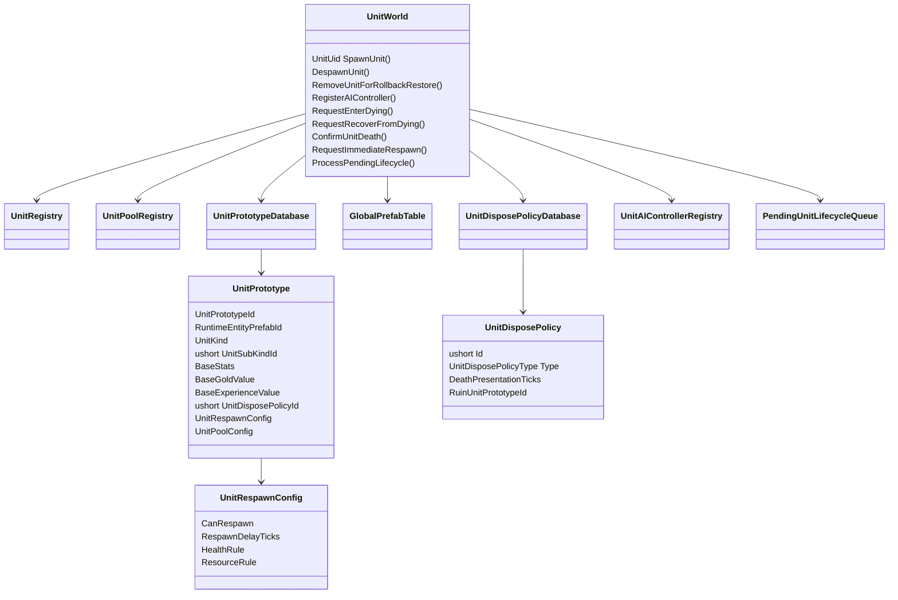

# 生命周期稳定顺序与恢复

## 本功能范围

本案细化“同步生成死亡复活与回池”中的生命周期稳定顺序与恢复，仅覆盖下列明确接口与边界。

## 目标实现

单位生死、复活、规则移除和池化形成单一生命周期。

## 技术方案

UnitWorld 同步 Spawn；生成当 Tick 可被动参与，主动工作要求 CurrentTick>SpawnLogicTick。RequestEnterDying、RequestRecoverFromDying、ConfirmUnitDeath 是正式入口。

## 边界情况

ClearForDeath、ClearForRespawn、ClearForDespawn 按固定顺序；永久 Buff 与装备跨死亡保留所属状态；回池新生命周期不沿用旧身份。

## 验收条件

- 正常路径达到上述目标，并由所属模块唯一拥有权威状态。
- 以上边界情况有明确返回、拒绝或可见失败；不得用占位成功代替行为。
- 确定性逻辑比较重复执行、改变插入顺序以及捕获/恢复/重演结果；只读界面不得改变 Gameplay。

## 工程实际核查

实现证据与已有测试位置关联总案；字段存在不能认定行为已验收。

### 生命周期清理顺序

`UnitWorld` 对单位 Handler 的生命周期调用顺序正式冻结为：

```text
1. MovementHandler
2. AttackHandler
3. AbilityHandler
4. BuffHandler
5. CrowdControlHandler
6. EquipmentHandler
7. StatHandler
```

规则：

```text
死亡阶段：
    按上述顺序调用 ClearForDeath。

复活阶段：
    按完全相同的顺序调用 ClearForRespawn。

非死亡 Despawn：
    按完全相同的顺序调用 ClearForDespawn。
```

`ActionRuntimeSet.CancelAll`、`Intent.Clear` 和 Reservation 释放位于 Handler 生命周期调用之前，它们不是 Handler 路由的一部分。

固定顺序的目的不是要求每个 Handler 删除全部状态，而是让各模块在稳定位置处理自己拥有的生命周期接缝：

```text
MovementHandler
    终止普通移动与强制位移执行状态。

AttackHandler
    清理当前攻击生命周期。

AbilityHandler
    中断当前施法；
    固定技能被动 Runtime 按规则保留。

BuffHandler
    清理非永久 Buff；
    永久 Buff Runtime 按规则保留。

CrowdControlHandler
    清理当前生命阶段的控制、免疫和不可阻挡 Handle。

EquipmentHandler
    保留装备与常驻被动 Runtime。

StatHandler
    不全量清空 Modifier；
    只完成数值系统自身的生命阶段收口。
```

复活时，跨死亡保留的来源根据自身 Runtime 重建**当前生命阶段 Handle**：

```text
固定技能被动
    -> AbilityHandler.ClearForRespawn 中重建生命阶段 Handle。

永久 Buff
    -> BuffHandler.ClearForRespawn 中重建生命阶段 Handle。

常驻装备被动
    -> EquipmentHandler.ClearForRespawn 中重建生命阶段 Handle。
```

必须区分：

```text
PersistentHandle
    跨死亡持续存在，不在复活时重复 Attach。

LifeStageHandle
    死亡时结束，复活时由保留 Runtime 重新建立。
```

复活不是再次执行死亡清理；`ClearForRespawn` 只执行各 Handler 自己的复活阶段逻辑。

正式死亡清理顺序：

```text
1. CombatSystem 在当前 Combat Settlement Cycle 内
   同步请求 UnitWorld 写入 Dead。

2. UnitEventBus 立即发布 UnitDeath。

3. 全部 Handler 完成 UnitDeath Reaction；
   新 CombatRequest 继续进入当前 Combat Settlement Cycle。

4. 终止 ActionRuntime、Reservation 和当前主动行为。

5. AttackHandler 清理当前攻击的临时状态。

6. AbilityHandler 中断当前施法 / 引导，
   但保留技能等级、冷却、固定被动和应跨死亡保留的 Runtime。

7. BuffHandler 只清理不跨死亡保留的 Buff；
   被清理来源通过自身 Handle 移除自己的 Modifier。

8. CrowdControlHandler 清理控制、控制免疫和强制行为胜者；
   控制来源通过自身 Handle 移除自己的 Modifier。

9. EquipmentHandler 通常保留装备、装备属性与常驻被动。

10. 清理护盾；黑盾通过正式路径解除对应免疫，
    除非具体规则明确允许跨死亡保留。

11. 禁止普通 Order、Planner、Action 和主动移动。

12. 非英雄管理模块注销或更新该 UnitUid 的管理关系。

13. UnitWorld 注销非英雄 UnitUid -> UnitAIController 映射。

14. 播放死亡动画。

15. 死亡表现结束后执行 DisposePolicy。
```

普通死亡和进入 `Respawning` 都禁止：

```text
StatHandler.ClearModifiers()
Unit.CombatModifiers.Clear()
```

每个来源只移除自己应结束的 Modifier。  
全量清空只允许用于：

```text
非死亡 Despawn 正式终止当前 UnitUid 生命周期
ResetForPool
InitializeForNewRuntimeUid
Unit Runtime 永久销毁
回滚拓扑中静默移除目标快照不存在的多余单位
确认所有挂载来源都已销毁的完整重置
```

进入 `Respawning` 时再次执行幂等临时状态清理，但不能把“幂等清理”解释为删除全部属性与战斗 Modifier。

对象池新运行时初始化顺序：

```text
Rent / Instantiate
    ↓
Bind Owner 与固定 Handler
    ↓
创建或绑定 Unit.CombatModifiers
    ↓
在所有旧来源 Runtime 已经销毁后执行完整重置
    ↓
StatHandler.ClearModifiers
    ↓
CombatModifiers.Clear
    ↓
InitializeForNewRuntime
    ↓
应用 Prototype 静态数据
    ↓
分配新 UnitUid / Team
    ↓
重置 StatSeq 和其它新生命周期计数器
    ↓
初始化 Stat / Ability / Attack / Buff / CrowdControl
    ↓
绑定 PhysicsEntity2D 查询快照
    ↓
注册 Unit 和 Physics
```

---

### 帧同步关注点与统一回滚接缝

统一回滚协议：

```csharp
public interface IRollback<TState>
{
    void Capture(ref TState state);
    void Restore(in TState state);
    void Resolve(in RollbackContext context);
    void Rebuild(in RollbackContext context);
}
```

`UnitWorld` 是单位、`UnitUid -> UnitAIController` 唯一映射、Controller 运行状态和待处理跨 Tick 生命周期节点的聚合入口；小兵、野怪等管理方只聚合自己管理的 `UnitUid`、AI 分配与玩法业务状态。  
只有包含影响未来模拟的权威运行状态的 Handler 才需要实现对应 `IRollback<TState>`；不为无状态 Handler 创建空快照。

单位框架标记以下状态：

```text
UnitWorld 注册关系。
UnitWorld 帧内单位生成序号。
UnitUid -> UnitAIController 唯一注册关系。
Controller 自身真实存在的运行状态。
待处理死亡表现和正常复活节点。
Unit LifeState。
对象池逻辑激活状态。
Intent、ActionRuntimeSet 和有状态 Handler。
英雄复活就绪 Tick。
UnitUid 与跨系统引用。
StatHandler 的完整逻辑状态。
CombatModifierSet 的完整有效 Record 状态。
```

不保存：

```text
FirstAITickLogicTick
FirstActiveLogicTick
仅由注册关系、LifeState 和 SpawnLogicTick 推导的 AI Enabled 状态
```

主动 Gameplay 是否可执行统一由：

```csharp
SimulationTickContext.Current.Tick
    > unit.UnitUid.SpawnLogicTick
```

推导。

四阶段接缝：

```text
Capture
    保存 UnitWorld、Unit、唯一 AIController 注册关系、
    Controller 真实运行状态和有状态 Handler。
    MinionSystem / JungleCamp 只保存受管 UnitUid、
    AIProfile 分配和自身业务状态。
    StatHandler 直接保存属性条目、Modifier、StatSeq、
    当前状态、护盾和帧间变化基线。
    CombatModifierSet 直接保存当前有效的不可变 Record。
    来源 Runtime 同时保存自己的 StatModifierHandle
    和 CombatModifierHandle。

Restore
    先由 UnitWorld 对齐当前运行时拓扑与目标快照：
        当前存在但快照不存在的单位
            -> RemoveUnitForRollbackRestore 静默移除。
        快照存在但当前缺失的单位
            -> 创建运行时载体。
        双方都存在的单位
            -> 保留对象并直接恢复。

    随后直接恢复历史状态。
    不调用 Add / Set / Remove / Attach / Detach / Clear。
    不触发 UnitEventBus、属性变化通知或护盾业务回调。
    不能通过普通死亡清理或 Gameplay Despawn 替代回滚恢复。

Resolve
    由 UnitWorld 按 UnitUid 修复 Owner、Target、
    AIController 唯一绑定；
    小兵、野怪管理方只修复受管 UnitUid 与业务记录，
    然后继续修复技能和其它跨系统引用。
    Handle 只包含稳定逻辑身份，不保存对象引用。

Rebuild
    只重建真正的派生内容：
        Physics 空间索引。
        CapabilityState。
        CrowdControlStateView。
        UI / Presentation 镜像。
        临时查询和调试缓存。

    不重建 StatModifier。
    不重新 Attach CombatModifier。
    不重建 WatchHook 监听关系，因为 WatchHook 没有监听注册。
    不重建 FirstAITickLogicTick，因为该字段不存在。
```

具体快照字段布局和序列化格式仍由帧同步设计案统一定义。  
`SimulationTickContext` 不作为普通参数层层传递；需要当前 Tick 时读取：

```csharp
SimulationTickContext.Current.Tick
```

### UnitWorld 类图




## 需求演进

### 2026-10-02

变动内容：生成 Tick 可被动参与，主动工作晚于出生 Tick。

legacyDecision：D-008

### 2026-10-02

变动内容：正式死亡由 UnitWorld 同步执行，来源系统仅清理自己的句柄。

legacyDecision：D-009

