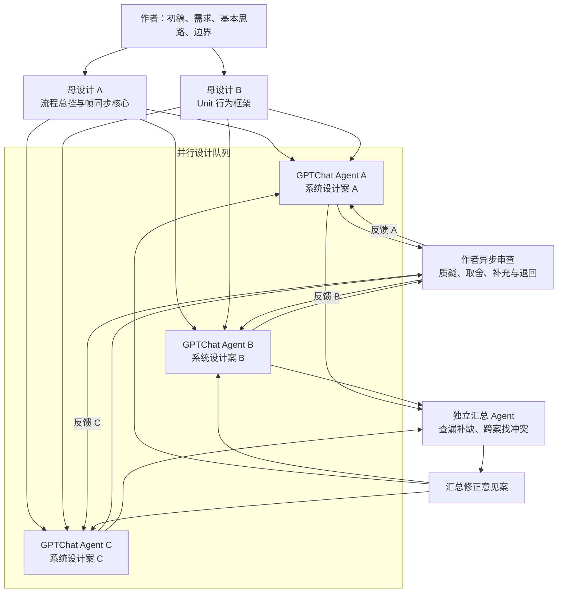
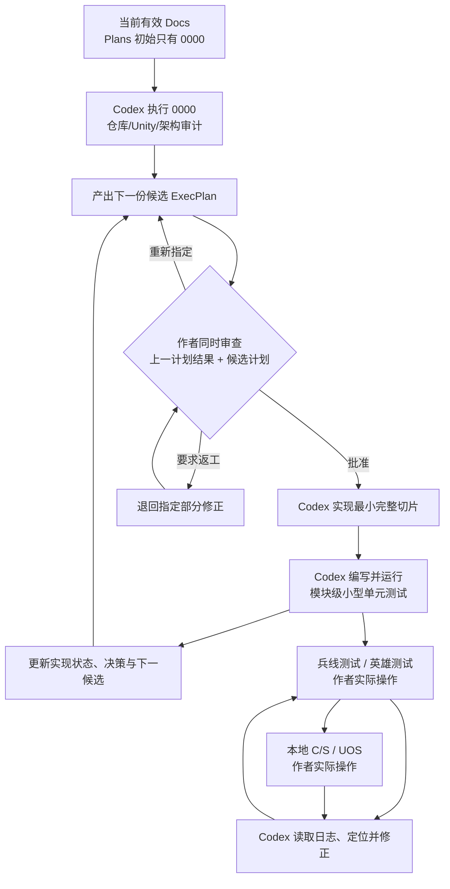
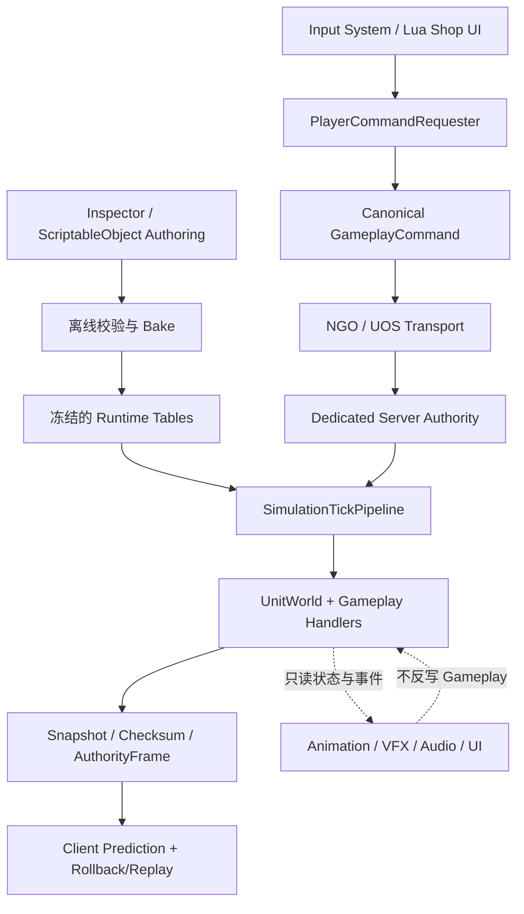
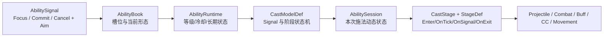
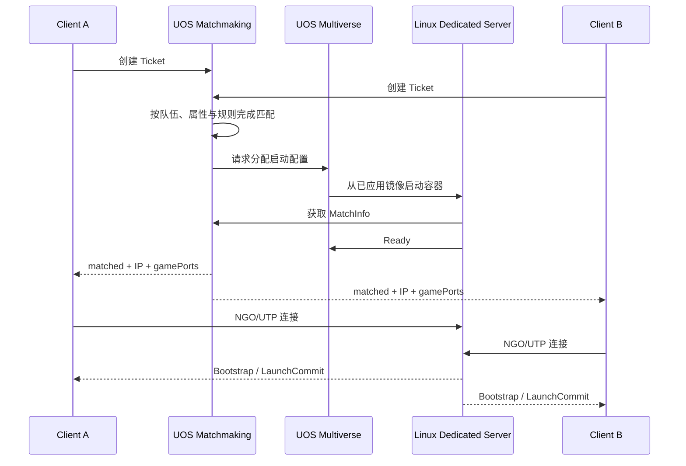
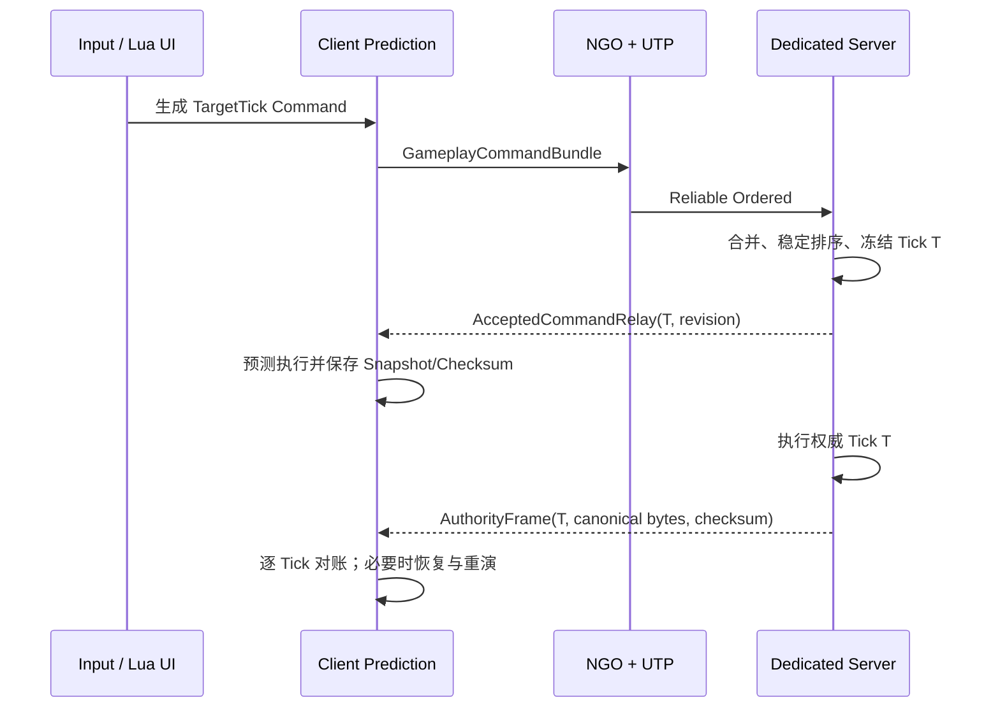
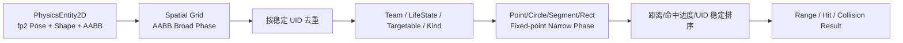

# FrameSyncMobaDemo

一个由 AI 深度参与设计、实现和验证的确定性帧同步 MOBA 技术演示项目。项目基于 Unity 2022.3 LTS，覆盖 Dedicated Server、双客户端预测、权威帧校验、回滚重演、UOS 在线匹配，以及一套可配置的 MOBA Gameplay 框架。

> 当前定位是“可运行的框架与内容垂直切片”，不是完整商业游戏。核心 C/S 与 UOS 双客户端流程已经跑通；正式内容目前以韦鲁斯、亚托克斯、小兵、防御塔、装备商店和一张测试地图为主。

## 项目展示

- [UOS 公网双客户端实机演示 · Client A 视角](https://www.bilibili.com/video/BV1KwgF6MEYD/)
- [UOS 公网双客户端实机演示 · Client B 视角](https://www.bilibili.com/video/BV1KwgF6MEGa/)

## 这个项目做了什么

- 固定 Tick 的确定性 Gameplay 模拟，权威逻辑不依赖渲染帧率。
- 一个 Dedicated Server 加两个独立客户端的完整流程：主界面、匹配、选人、加载、对局、死亡和复活。
- 客户端预测、规范化 Command、服务端权威帧、逐 Tick 校验、快照恢复、回滚重演和缺帧恢复。
- UOS Matchmaking、Multiverse 分配、Linux Dedicated Server 和公网 NGO 连接。
- 数据驱动的 Unit、Attack、Ability、Buff、Crowd Control、Projectile、Combat、Equipment、Shop 和 Gold 系统。
- 固定点数、稳定 UID、确定性随机、显式排序以及共享 Gameplay Checksum。
- A*、队伍流场、确定性 RVO、范围查询、投掷物扫掠检测和二维逻辑物理。
- 运行在确定性 Gameplay 世界中的小兵、防御塔与单位 AI，和玩家单位复用同一套行为、技能与战斗框架。
- xLua 驱动的主界面、匹配、选人、加载、HUD、商店与结算页面。
- 独立表现层：Animator 状态投影、对象池 VFX/SFX、技能指示器、击飞/击退高度表现、红蓝方相机与鼠标高亮检测。
- 面向自动化的 Unity MCP 工作流、EditMode/PlayMode 测试、异步诊断日志和一键构建工具。

## AI 如何工作

这不是一个由单次提示词生成的 Demo。项目把研发明确拆成“设计案生产”和“计划驱动编码”两个阶段：项目作者始终掌握需求、取舍、审查和验收；网页端 ChatGPT（下文简称 GPTChat）负责与作者共同演进设计；Codex 负责全部代码和 Unity 工程实现。

> 本节的“AI”专指参与研发的 GPTChat 与 Codex。游戏里的小兵、防御塔和单位 AI 是确定性 Gameplay 功能，使用 Unit 行为框架运行，不会调用大语言模型。

### 第一阶段：两份母设计驱动的多 Agent 设计

项目最初只有两份母设计：

- [`FrameSync_Flow_Integrated_System_Design_v10_2.md`](Docs/Design/FrameSync_Flow_Integrated_System_Design_v10_2.md)：定义游戏流程总控、Dedicated Server/Client 边界、Command、权威帧、预测、回滚、快照接缝和每 Tick 总管线。
- [`unit_behavior_framework_design_v27_3.md`](Docs/Design/unit_behavior_framework_design_v27_3.md)：定义 Unit、Handler、Intent、行为规划/仲裁、生命周期和单位内各能力模块的共同地基。

后续十余份设计案都直接或间接受这两份母设计约束。作者先提供某个系统的初稿、需求、基本实现思路和不可突破的边界，再由多个 GPTChat Agent 并行补全。它们不是排队串行工作：Agent A 完成一版时，作者立即审查并把意见退回 A；与此同时 B、C 仍继续工作。B 随后交稿，作者就切换去审查 B，再把修改意见送回。这个异步循环会持续多轮，复杂设计案可能迭代十几次。



设计阶段末期，不直接宣布所有文档“完成”，而是把全套设计交给另一位汇总 Agent：它跨文档检查遗漏、同名异义、所有权冲突、Tick 顺序矛盾、快照边界和循环依赖，并形成一份修正意见案。意见再回到原设计 Agent 继续迭代；“汇总检查 → 修正 → 再汇总”本身也重复多次。最终由 [`DESIGN_INDEX.md`](Docs/Architecture/DESIGN_INDEX.md) 指定每个系统当前唯一有效版本，由 [`DECISION_LOG.md`](Docs/Architecture/DECISION_LOG.md) 冻结跨模块决策。

### 第二阶段：计划驱动的 Codex 编码

进入编码阶段时，先把完整 `Docs` 设计体系交给 Codex；当时 `Plans` 中只有 [`0000_repository_audit_and_framework_planning_execplan.md`](Docs/Implementation/Plans/0000_repository_audit_and_framework_planning_execplan.md)。`0000` 不写玩法代码，而是审计仓库、Unity、依赖方向、设计权威、缺失契约和验证基线，并给出下一批候选实施计划。



作者不是只在结尾验收：每完成一个计划，都会同时审查“上一计划究竟做对了什么”和“下一计划准备改什么”，可以批准、要求退回某一部分，或直接重新指定候选。Codex 负责每个模块随实现附带的小型 EditMode/纯逻辑测试；兵线测试、英雄测试属于中型人工测试；Dedicated Server + 双客户端的本地 C/S 和 UOS 公网对局属于大型人工测试。中大型测试由作者真实操作，Codex 读取客户端、服务端与异步诊断日志，复现、定位、修正，再回到同一验证环。

### Unity MCP：让 AI 真正操作和验证 Unity

本项目使用开源的 [IvanMurzak/Unity-MCP（AI Game Developer）](https://github.com/IvanMurzak/Unity-MCP)。它通过 Model Context Protocol 把 Unity Editor 的资产、场景、层级、脚本、Console、Test Runner 和 Profiler 等能力暴露给 AI Agent；官方仓库提供 70 多个内置工具，并允许通过反射调用项目中的 C# 方法。

在本项目里，Unity MCP 不是游戏运行时 AI，也不参与 Gameplay 决策。它是 Codex 与 Unity Editor 之间的工程操作桥梁，用于：

- 检查并修改 Scene、Prefab、ScriptableObject、Animator 和序列化引用；
- 触发脚本编译，读取真实 Console 错误与警告；
- 运行 EditMode/PlayMode 测试并读取结果；
- 调用构建菜单或项目 Editor 工具，检查 Unity 当前是否 Busy/Compiling/Playing；
- 截图、分析 Profiler 数据和验证表现层资产。

因此编码闭环不是“Codex 改文本后假设 Unity 能运行”，而是“设计契约 → 代码/资产变更 → Unity 实际导入和编译 → 自动测试 → 人工 C/S/UOS 实测 → 日志修正”。发布后的客户端和服务器不会调用 GPTChat、Codex 或 Unity MCP。

## 总体架构



程序集保持单向依赖，网络、输入和表现实现不会反向进入确定性 Gameplay：

```text
Deterministic      Physics      RuntimeConfig
       \              |              /
                       Unit
                        |
                    FrameSync
                        |
                    PlayerInput
                        |
               LuaBridge / Bootstrap
```

| 层 | 主要位置 | 职责 |
|---|---|---|
| Deterministic | `Assets/Scripts/Deterministic/` | 固定点、Tick 上下文、确定性随机和基础值类型 |
| Physics | `Assets/Scripts/Physics/` | 二维逻辑空间、形状、网格、碰撞与查询 |
| Gameplay / Unit | `Assets/Scripts/Gameplay/` | UnitWorld、Handler、战斗、技能、Buff、装备、投掷物和 AI |
| FrameSync | `Assets/Scripts/FrameSync/` | Command、Tick 管线、快照、校验、预测、回滚和权威恢复 |
| PlayerInput | `Assets/Scripts/PlayerInput/` | 本地输入事件到施法意图与规范 Command 的转换 |
| RuntimeConfig | `Assets/Scripts/RuntimeConfig/` | 全局配置、Prefab 表与离线校验/Bake |
| LuaBridge | `Assets/Scripts/LuaBridge/`、`Assets/StreamingAssets/Lua/` | Lua UI 生命周期与只读 Gameplay 视图 |
| Bootstrap | `Assets/Scripts/Bootstrap/` | 场景、NGO/UOS、流程组合、HUD 与表现层接线 |

## 核心系统架构

### Unit：所有单位共用的行为内核

`Unit` 是身份、阵营、生命周期状态和 Gameplay 能力的聚合根，不是一个塞满英雄逻辑的巨型脚本。英雄、小兵和防御塔通过不同 `UnitPrototype` 与 `HandlerLoadout` 组合能力，但共用同一条行为链：

```mermaid
flowchart LR
    Source["玩家 Command / 单位 AI"] --> Order
    Order --> Intent["Intent<br/>持续目标"]
    Intent --> Planner["BehaviorPlanner<br/>决定下一步申请什么"]
    Planner --> Request["类型化 ActionRequest<br/>一次性申请"]
    Request --> Arbiter["ActionArbiter<br/>状态/控制/距离/资源仲裁"]
    Arbiter --> RuntimeSet["ActionRuntimeSet<br/>Main + Base"]
    RuntimeSet --> Runtime["ActionRuntime<br/>取消/打断/结束"]
    Runtime --> Handler["Movement / Attack / Ability Handler"]
    Handler --> External["Physics / Projectile / Combat 等外部系统"]
```



这条链把“想做什么”“现在该做什么”“能否开始”“开始后如何持续”拆开：`Intent` 可在追击途中长期保留，`BehaviorPlanner` 只产生临时请求，`ActionArbiter` 是普通动作唯一入口，`ReservationState` 防止冲突，`ActionRuntimeSet` 的 Main/Base 双槽允许基础移动与主行为按规则共存。控制产生的恐惧、魅惑、嘲讽先变成 `BehaviorOverride`，仍经 Planner/Arbiter；击飞、击退、拉回属于空间覆盖，绕过普通动作链，由控制系统仲裁后交给移动系统。

Unit 内部按能力装配 `MovementHandler`、`AttackHandler`、`AbilityHandler`、`BuffHandler`、`CrowdControlHandler`、`EquipmentHandler` 和 `StatHandler`。`UnitWorld` 统一拥有稳定 `UnitUid` 注册、出生、`Alive → Dying → Dead → Respawning` 状态转换和固定生命周期顺序；每个 Handler 只清理自己创建的 Runtime/Handle，避免死亡时“一键清空所有 Modifier”破坏跨死亡被动和装备状态。

游戏内 AI 也遵守这套边界。小兵、防御塔等管理器选择 AI Profile 并注册控制器，`UnitWorld` 只维护按 `UnitUid` 稳定排序的 AI 集合。AI 直接读取 Ability/Attack 定义与当前 Runtime，产生已有的 Order、Action 和 `AbilitySignal`；它不模拟键鼠、不经过玩家输入模块，也不制造玩家网络 Command。

### Combat：强类型请求、公式修正与死亡结算

Combat 不让攻击、技能、Buff、装备各自直接扣血，而是把它们收敛为 `ShieldRequest`、`DamageRequest`、`HealRequest` 三种最小强类型请求。三条队列共享一个 `SequenceInTick`，结算器始终比较队首，以保留跨类型请求的全局确定顺序。

```mermaid
flowchart LR
    Sources["Attack / Ability / Buff / Equipment / Projectile"] --> Queues["Shield / Damage / Heal Queues<br/>共享 SequenceInTick"]
    Queues --> Payload["Payload + Context + Recipe"]
    Payload --> Mods["收集 Outgoing / Incoming<br/>CombatModifierRecord"]
    Mods --> Formula["固定 Formula Slots<br/>Add / Multiply / Clamp / Policy"]
    Formula --> Apply["Shield / Resistance / Health"]
    Apply --> Result["强类型 Result + UnitEventBus"]
    Result --> Pending["PendingDying / Contribution Log"]
    Pending --> Lifecycle["UnitWorld Dying / Death / Respawn"]
    Lifecycle --> Reward["MatchStatistics → Gold Allocation"]
```



以伤害为例，正式管线是 `Request → Payload → Context → Recipe → Collect Modifiers → Raw Damage → Crit → Resistance → Shield → Health → PendingDying → LifeSteal/Omnivamp → Attack Effect → Result`。技能、Buff 和装备在各自生效点创建 `CombatModifierRecord`，挂到单位的 `CombatModifierSet`；Combat 只按 Domain、Scope、Match、FormulaSlot 和 Operation 读取它们，不接管来源的层数、冷却和生命周期。

| 管线 | 主要阶段 | 关键语义 |
|---|---|---|
| Shield | Request → Context/Recipe → Modifier → Formula → Add Shield | 先结算濒死欠账等规则，再把剩余值写入护盾容器 |
| Damage | Request → Raw/Crit/Resistance → Shield → Health → Derived Effects | 在真实结算时读取当前属性；吸血、全能吸血和攻击特效从最终结果派生 |
| Heal | Request → Context/Recipe → Modifier → Formula → Apply Health | 处理禁疗、增疗、上限与实际治疗量，并可救回 PendingDying 单位 |
| Natural Regen | Stat Dirty 刷新后按固定阶段推进 | 不绕过 Combat 的时序边界，不读取渲染时间 |
| Death/Reward | PendingDying → Dying Reaction → FormalDeathResult | 冻结击杀者、助攻贡献和奖励输入，再由统计与金币生产器稳定分配 |

生命第一次归零只建立 `PendingDyingRecord`，单位仍可被同 Tick 后续治疗或护盾救回。三条队列清空后才请求 `UnitWorld` 进入 `Dying`，立即执行死亡阻止/濒死复活；最终死亡时冻结贡献与奖励并确认 `Dead`。普通 Damage/Heal 反应仍在当前 Tick 结算，只有 `UnitDeath`/`UnitKill` 新产生的战斗请求进入 `DeferredCombatRequestBuffer`，在下一 Tick 按稳定序号导入，从而避免死亡回调递归改变同 Tick 顺序。

### Ability：施法协议与技能内容分离

输入层和 AI 都不会把键盘、鼠标或“AI 请求”塞进技能系统。它们最终只使用三个 Gameplay 动词：`Focus`、`Commit`、`Cancel`，连同目标单位、目标点或方向组成 `AbilitySignal`。



`CastModelDef` 只回答“什么 Signal 创建 Session、当前在哪个阶段、何时切换/超时/结束”；`StageDef` 只回答“该阶段实际做什么”。普通确认施法、蓄力释放、持续引导和持续阶段内多次确认由少量通用 CastModel 覆盖；伤害、投掷物、位移、标记或范围增长属于可组合 Stage 内容。一个技能槽可以长期保存多个 `AbilityRuntime` 并切换当前形态，未激活形态仍保留自己的等级、冷却和被动状态。

### Attack 与 Projectile：攻击会话、弹道和命中解耦

普通攻击由 `AttackHandler` 管理目标、前摇、Commit、后摇、取消和攻击重置；近战 Commit 可直接提交 Combat，远程 Commit 则生成 Projectile。强化普攻在攻击开始时锁定到本次 AttackSession，后续动画和命中读取同一份已快照状态，不会因飞行途中被动变化而改判。

Projectile 是独立的确定性运行对象，拥有稳定 UID、运动、生命周期、目标过滤、命中记忆和效果发射；其空间形状绑定到 `PhysicsEntity2D`，但物理系统不替它决定何时销毁或造成什么效果。每 Tick 按 `CommitSpawns → AdvanceMotion → UpdateLifecycle → ResolveHits → EmitEffects → FlushDestroy` 推进，命中候选按运动距离与目标 UID 稳定排序，再由 Projectile 决定穿透、最大命中数以及向 Combat/Buff/CC 发出什么正式请求。

### Buff：定义、Runtime、Blackboard 与来源所有权

同一单位、同一 `BuffConfigId` 最多存在一个 `BuffRuntime`。查找表只负责 O(1) 定位，推进和事件 Reaction 则按 `BuffConfigId` 的稳定顺序遍历。重复施加不偷偷创建第二实例，而是按 `LifeRule` 和 `StackRule` 覆写持续时间与层数。

`BuffDefinition` 保存静态 Effect/Reaction；`BuffRuntime` 只保存来源、层数、持续时间和定长 `BuffBlackboard`。属性修正、Combat 修正、周期伤害、追加 Buff、施加控制等 Effect 都走固定生命周期入口。哪个 Effect 创建 `StatModifierHandle`、`CombatModifierHandle` 或外部运行对象，哪个 Effect 就把 Handle 写入自己的 Blackboard 槽，并负责更新、死亡清理、复活重建和最终移除。这样 BuffHandler 不需要理解每种效果，也不会扫描黑板做猜测式清理。

### Equipment / Shop / Gold：装备效果与交易账本分离

装备系统分为三层静态配置：`EquipmentDefinition → EquipmentEffectDef[0..2] → EquipmentEffectModule[0..N]`。Definition 管身份、价格、固定属性、标签和配方；EffectDef 表达一个完整主动/被动效果；Module 表达事件触发、Tick、动态属性或 CombatModifier 等单项功能。装备栏固定六格，实例保存堆叠、充能、冷却和效果 Runtime；固定属性与被动 Handle 仍遵循“创建者拥有并清理”的规则。

商店没有第二份商品表，直接枚举 `GlobalGameplayData.EquipmentDatabase`。购买 Command 只表达玩家和目标装备，不允许客户端指定最终槽位；所有端在目标 Tick 依据同一六格状态、配方顺序和低槽位优先规则生成相同 `EquipmentPurchasePlan`，先模拟消耗组件，再判断合成后槽位、成装重复和唯一标签是否合法。动态价格等于目标价值减去本次确定性选中的组件价值。

Gameplay 收入与可逆交易被刻意拆开：

```text
补刀 / 击杀 / 助攻 / 自然收入 / 地图奖励
    → GoldIncomeRuntime
    → 每 Tick Batch + Digest
    → AuthorityFrame 连续确认后成为 ConfirmedEarnedGoldTotal

购买 / 出售 / 撤销
    → EquipmentShopRuntime.OperationLog
    → UndoableOperationStack（严格 LIFO）

CurrentAvailableGold
    = ConfirmedEarnedGoldTotal + EffectiveShopGoldDelta
```

`CurrentAvailableGold` 是只读派生值，不是另一份同步状态。UI 本地 `RequestCheck` 只决定是否提交 Command 并立即显示失败原因；目标 Tick 上所有端仍执行同一 `ProcessCommand` 可行性检查。撤销通过操作日志反演原交易，离店、装备使用或参与战斗可按规则使撤销永久失效。

### Crowd Control：Bake 后模块表与结果汇总

控制系统不按 `Stun/Slow/Fear/KnockBack` 写巨型 switch，而是把一个 `CrowdControlDefinition` Bake 成紧凑模块操作数组，通过静态执行函数表运行。`Modules` 定义控制做什么，`Tags` 定义如何被识别、免疫和净化，Key Parameters 在编辑器中可读、运行时则编译为紧凑 Offset。

每次 Add 创建独立控制实例，不自动合并或刷新旧实例；Handler 按 `InstanceId` 稳定扫描并汇总为 `CrowdControlStateView`：动作限制和标签按位 OR，移动/攻速减速取最大值，视野比例取最小值，强制行为按 `Priority → StartTick → InstanceId` 选稳定胜者。控制免疫在创建实例前阻止，净化移除已存在实例，不可阻挡抑制控制输出并拒绝强制位移；三者不是同一个机制。

控制不进入 Combat 的第四条队列，因为伤害/技能/投掷物的正式生效点本身已有确定顺序，而且控制经常必须立即影响同 Tick 后续动作。击退、击飞、拉回由 `CrowdControlHandler` 保证每单位最多一个活动强制位移，优先级胜出后只提交一次 `ResolvedForcedMove`，轨迹逐 Tick 执行交给 `MovementHandler`。

### UOS 在线对局链路



UOS 只负责在线服务发现、匹配与战斗服托管，不取代项目自身的帧同步协议。Matchmaking 根据配置把玩家组成对局；Multiverse 根据 Profile、镜像、地域和容量创建 Linux Dedicated Server；客户端拿到映射后的 IP/端口后，仍通过 NGO/UTP 连接本项目的权威服务端。

开局也采用显式两阶段屏障：客户端完成场景加载后发送 `SceneLoaded`，服务端下发 Bootstrap 快照；客户端恢复快照并完成本地单位绑定后发送 `BootstrapApplied`；服务端等待所有客户端确认，再广播唯一 `LaunchCommit`，各端才开始 Tick。这个握手把“资源加载完”“权威世界已应用”和“统一开始模拟”区分开，避免某个客户端在 UOS 网络环境中提前跑出几十秒预测。

## 关键技术与算法

### 帧同步核心：同步输入与验证结果，而不是持续同步世界状态

本项目采用 Dedicated Server 权威、客户端预测的确定性帧同步。客户端把设备输入一次性翻译成带 `TargetTick` 的 `GameplayCommand`，按 `TargetTick → PlayerSlot → ControlledUnitUid → CommandSeq` 合并、排序并规范序列化；服务端反序列化后再次执行相同规则，在 Tick 开始时冻结最终 Command 集合。客户端与服务端执行同一 Gameplay Tick 管线，而不是由服务端持续广播每个单位的位置、血量和 Buff 全量状态。



`AcceptedCommandRelay` 是某 Tick 当前命令集合的完整替换版本；已预测 Tick 收到新 revision 时，只记录最早 Dirty Tick，同一网络批次结束后回滚一次。最终 `AuthorityFrame` 携带 Tick、最终命令 revision、完整 Canonical Command Bytes、Flags 和必填 `SharedGameplayChecksum`，不传伤害结果、金币结果或“修正后世界状态”。这使网络层既能提前提供远端输入，又能在 Tick 完成后证明输入与结果一致。

网络传输使用 NGO/Unity Transport；`GameplayCommandBundle`、Relay 和 AuthorityFrame 走可靠有序通道，Recovery 请求可靠、恢复帧可靠有序。UOS Matchmaking/Multiverse 只解决公网匹配和 Linux 战斗服分配，连接建立后跑的仍是同一套 NGO/UTP 帧同步协议，因此本地 C/S 与 UOS 共用 Gameplay 和协议实现。

### 三个时钟、预测窗口与连续权威屏障

系统刻意区分三个 Tick：`ServerTick` 是服务端下一次准备执行的 Tick；`LatestAuthorityFrameTick` 是客户端已连续接收、对账并接受的最新权威 Tick；`LocalSimulationTick` 是客户端下一次准备预测的 Tick。客户端可以领先，但 `MaxPredictionLeadTicks` 限制预测窗口，`MaxLogicTicksPerUnityFrame` 只作为卡顿补跑/回滚重演的 CPU 保护阀。

AuthorityFrame 必须严格按 Tick 连续接受。即使先收到 Tick 102，只要 101 缺失，连续权威边界就不能越过 100。客户端暂停新预测但继续收包、采集输入和更新表现，并通过 `AuthorityRecoveryRequest(MissingRanges)` 精确补齐缺帧；当前方案不发送 BaseSnapshot，也不支持对局中途加入或客户端进程重启恢复。

### 每 Tick 快照、三阶段恢复与确定性故障检测

每完成 Tick `T` 就保存 `SnapshotTick = T + 1`。快照不是粗暴序列化 Unity 对象图，而是由 `UnitWorld`、Projectile、Combat、Shop、Physics、Random 等聚合根只保存真正跨 Tick 的权威状态；网格、查询缓存等可派生数据不重复保存。

恢复严格分为：

1. `Restore`：写回纯值、数组和稳定 ID。
2. `Resolve`：把 `UnitUid`、`ProjectileUid` 等跨系统引用解析回当前运行对象；非法引用是确定性恢复错误，不能静默丢弃。
3. `Rebuild`：重建空间网格、派生缓存和运行时接缝，禁止借机修改权威值或重复挂载 Modifier。

客户端处理 `AuthorityFrame(T)` 时同时比较 Canonical Command Bytes 与本地 `SharedGameplayChecksum(T)`。若不同，就从合法快照恢复，用 Tick T 的权威命令重演到原预测末端，并重新比较 T；若权威重演后仍不同，说明不是普通预测误差，而是确定性实现故障，客户端记录诊断并终止对局，避免把真正的分叉伪装成“同步成功”。

### 跨平台确定性：定点数、稳定身份、顺序与随机状态

固定 Tick 只解决“什么时候算”，不能单独保证“各端算得一样”。权威计算统一使用 `Unity.Mathematics.FixedPoint.fp/fp2`，金币、层数、Tick 和序号使用整数；Inspector 中的浮点仅作为 Authoring 输入，在离线校验/Bake 时一次性转换。随机数来自可快照、可校验的确定性随机服务。

所有会影响 Gameplay 输出的集合都定义稳定身份和比较键：单位、投掷物、技能 Session、控制实例和表现事件使用可复现 UID；请求、命中、邻居和奖励分配显式排序。权威逻辑不依赖 `float/double`、`UnityEngine.Random`、`Time.deltaTime`、Unity Physics、`GetInstanceID()`、对象创建/层级/组件注册顺序或 `Dictionary/HashSet` 枚举顺序。

### 定点二维物理：统一空间拥有者、宽相与精确相

项目没有把 Unity Physics 当作 Gameplay 权威，而是实现了自己的固定点二维逻辑空间。`PhysicsEntity2D` 是位置、上一位置、朝向、形状与 AABB 的唯一拥有者；`MovementHandler`、Projectile 等只能调用统一空间写入 API，不能散写字段。支持 `Point`、`Circle`、`Segment`、`Rect` 四种形状。



高速点状或圆形投掷物使用 `PrevPosition → Position` 的线段扫掠，与目标圆求最近点，避免跨过目标却漏判；圆、线段、旋转矩形分别使用半径合并、点到线段和局部空间 Clamp 做精确相交。范围查询必须“收集全部候选 → UID 去重 → 业务过滤 → 精确测试 → 稳定排序 → 截取 MaxResult”，不能因网格桶遍历顺序提前 break。

物理世界维护两张不同时间语义的单位网格：移动前 `RvoGrid` 供避障读取，移动/强制位移/墙体修正后的 `UnitFinalGrid` 供碰撞、范围查询和投掷物命中。两者是可重建索引，不进入完整快照。逻辑姿态最终只由 `PhysicsEntity2D.LateUpdate` 单向写入实体根 Transform；动画、击飞高度、镜头平滑和受击抖动只能修改表现子节点，不能反写逻辑位置。

### Direct、A*、队伍流场与确定性 RVO

寻路不是“所有单位每次都跑 A*”。`RouteResolver` 按 `MovePurpose` 分流：短距离且视线可行走的点移动走 Direct；英雄追击、施法接近和回营地走 A*；大量兵线单位读取预构建的队伍流场。`UnitLocomotionAgent` 拥有路线与游标，只输出当前 Tick 的 `LocomotionResult`；`MovementHandler` 消费结果并最终提交空间变化，避免路径、位置和控制优先级被多处重复拥有。

- **A\***：八方向网格使用 Indexed Binary Heap + `DecreaseKey`，OpenSet 比较固定为 `F → H → NodeIndex`；启发函数采用 Octile Distance（斜向 14、直向 10），禁止斜穿墙。终点不可走时按方形环搜索最近可走格，距离相同时用 CellIndex 打破平局；路径返回后用固定方向的 LOS 检查做确定性简化。
- **队伍流场**：对每条兵线分别反向构建整图成本场，再让每个格子选择最低成本的 `OwnerLane`，平局按 LaneIndex。`NextCell` 必须严格指向更低成本的邻居；贴墙、方向平滑和兵线骨架只是候选评分项，不能对方向向量做可能破坏下降性的 Lerp。大量小兵只读取 `DirectionCode/NextCell`，不为每个单位维护完整路径。
- **确定性 RVO**：先按 `UnitUid` 为所有单位计算同一时间切片的原始期望速度，再从移动前 `RvoGrid` 查询邻居，按 UID 排序并限制最大邻居数。候选速度集合固定生成，使用碰撞风险/偏离期望速度等代价选最小惩罚，完全相同则再用速度 TieBreaker。所有单位算完 RVO 后才统一移动，消除“先移动谁、后移动谁”造成的结果差异。

### Lua/UI：脚本化页面，但不建立第二份 Gameplay 状态

UI 使用 xLua。`LuaManager` 维护唯一 `LuaEnv`、Loader 和 Tick；`require` 得到缓存的页面模块原型，而每次 `module.New(refs)` 创建独立 LuaTable 页面实例。`LuaHost` 只是 C# 对该实例的轻量代理，缓存固定生命周期委托并负责释放；`UIManager/UIPanel/UIList/UICell` 管理页面层级、Overlay 与列表格复用。

Lua 可以直接读取经过导出的静态数据库、Unit/Handler 只读视图、`WatchableValue/WatchHook` 和 `IEquipmentShopView`，也可以调用技能升级、购买、出售、撤销等类型化 Request；它不能直接改 `StatHandler`、技能 Runtime、装备槽、商店账本或 Command Buffer。UI 不进入 GameplaySnapshot，不参与预测、回滚或 AuthorityRecovery；恢复完成后重新查询当前状态。这样 HUD 和商店可以快速迭代，但不会形成与确定性 Gameplay 竞争的第二份 Store。

### 可回滚 Gameplay 与不可反写的表现层

Animator、VFX、音频、技能指示器、鼠标高亮、相机和 UI 只消费 Gameplay 只读状态或表现事件。`PresentationEventId` 给一次逻辑事件稳定身份，客户端事件账本据此避免回滚重演时重复播放。模型层击飞/击退 Y 曲线、亚托克斯翅膀、塔锁定线等都是纯客户端表现；它们即使丢失或重建也不能改变命中、位置、控制持续时间或任何 Checksum 数据。

## 已实现的内容

### 英雄与战斗

- 韦鲁斯：蓄力 Q、W 枯萎与强化 Q、E 区域、R 蔓延、被动攻速效果。
- 亚托克斯：被动强化普攻、三段 Q 及剑锋击飞、W 投掷物/束缚区/拉回、E 位移、R 恐惧与属性 Buff。
- 普攻前后摇、弹道、攻击距离、护甲/魔抗、护盾、治疗、吸血、Buff、控制、死亡、复活与贡献日志。
- 小兵 21/14 金币、英雄 300 金币及稳定的击杀/助攻整数分配。

### 地图、单位与表现

- 两方近战/远程小兵、兵线推进、防御塔索敌/攻击和纯客户端锁定红线。
- 红蓝双方相反相机视角、相机调试场景、鼠标检测精度/性能与多子网格高亮描边。
- Animator 数据投影、亚托克斯形态/翅膀、三段 Q/W 编辑器 Gizmo、技能指示器和击飞/击退模型高度曲线。

### 装备、商店与金币

- 六格装备栏、重复规则、合成组件消耗、动态合成价格、购买、出售与撤销。
- 鬼索的狂暴之刃：攻击特效、层数和满层每第三次重复 On-Hit。
- 焚天：强化攻击、冷却、最大生命值相关效果与溢出治疗护盾链。
- 商店 UI 与 HUD 都读取正式全局装备表和同一个确定性运行时。

### 在线与工具链

- 本地 Windows Dedicated Server + 两客户端 Local NGO 测试。
- UOS Windows 客户端、Linux Dedicated Server、Matchmaking、Multiverse、Ready 和公网对局。
- UOS 客户端 GUI 启动器，可保存不同 TestAccountId/窗口名并启动多个客户端。
- UOS 服务端一键构建、自动 ZIP、SHA-256，以及无需重打包的手动压缩脚本。
- 可在构建时完全裁除的异步诊断系统。

## 设计案与模块对应关系

正式实现只参考 `Docs/Architecture/DESIGN_INDEX.md` 当前列出的版本；旧文件或示例不自动成为实现依据。

| 模块/系统 | 当前设计案 |
|---|---|
| 帧同步、流程、权威帧、恢复、比赛规则 | `Docs/Design/FrameSync_Flow_Integrated_System_Design_v10_2.md` |
| 快照精确成员与三阶段恢复 | `Docs/Design/FrameSync_Snapshot_Contents_Appendix_v7_2.md` |
| Unit、Handler、行为 AI、生命周期 | `Docs/Design/unit_behavior_framework_design_v27_3.md` |
| 战斗、死亡、贡献、奖励 | `Docs/Design/moba_combat_system_design_v13_2.md` |
| 投掷物 | `Docs/Design/MOBA_FrameSync_Unity_Projectile_System_Design_v19.md` |
| 技能、CastModel、Stage、被动 | `Docs/Design/moba_ability_system_design_v15_2.md` |
| 普通攻击 | `Docs/Design/moba_attack_module_design_v6_2.md` |
| Buff | `Docs/Design/BuffSystem_Design_v14_2_PermanentBuffRespawnPatch.md` |
| Crowd Control | `Docs/Design/moba_crowd_control_system_design_v6_2.md` |
| 装备、商店、金币 | `Docs/Design/moba_equipment_shop_gold_system_design_v12.md` |
| 二维物理与范围查询 | `Docs/Design/MOBA_UnitPhysics_RangeQuery_Design_v13.1.md` |
| 寻路、流场、RVO | `Docs/Design/MOBA_FrameSync_Integrated_Pathfinding_Design_v13_1.md` |
| 小兵、防御塔与非英雄单位 | `Docs/Design/moba_non_hero_unit_modules_design_v5.md` |
| 动画、VFX、音频与表现回滚 | `Docs/Design/moba_presentation_layer_integrated_design_v13_2_fifth_round_audio_entry.md` |
| UI 与 Lua | `Docs/Design/MOBA_UI_Lua_System_Design_v9_1_GoldIncomeRuntime_Aligned.md` |
| 玩家输入与非智能施法 | `Docs/Design/MOBA_Player_Input_Command_Module_Design_v1_1.md` |

架构冻结决策见 `Docs/Architecture/DECISION_LOG.md`，模块完成度和已知限制见 `Docs/Implementation/MODULE_STATUS.md`。

## 目录导航

```text
Assets/
  Config/Formal/              正式静态配置与全局表
  Resources/Prefab/Unit/      当前唯一的运行时单位 Prefab 目录
  Resources/Prefab/Missle/    投掷物与区域实体 Prefab
  Scenes/                     Client/Server/Lobby/Game 与测试场景
  Scripts/                    按程序集拆分的运行时代码与测试
  StreamingAssets/Lua/        UI Lua 脚本
Docs/
  Architecture/               设计索引、决策日志、仓库地图
  Design/                     当前系统设计案
  Implementation/             构建、测试、诊断、实现状态与 ExecPlan
Tools/
  UosClientLauncher/          UOS 客户端 GUI 启动器源码
  PackageLatestUosServer.*    最新 UOS 服务端手动压缩工具
Builds/                       本地客户端、服务端与上传包；全部被 Git 忽略
```

## 运行与构建

### 环境

- Unity `2022.3.62f1c1`
- Windows 编辑器；UOS 服务端目标为 Linux x86_64
- Git（部分 UOS/第三方依赖通过 Git URL 安装）
- 建议先同步操作系统时间。当前统一开局使用绝对 UTC 屏障，客户端与服务端时钟明显偏离会造成错误的开局等待与模拟 Tick 偏差。

克隆后使用指定 Unity 版本打开仓库根目录，等待 Package Manager 与脚本编译完成。UOS 在线运行还需要你自己的项目权限和有效配置；不要提交明文 Secret。

### 本地 C/S

在 Unity 菜单执行：

```text
FrameSyncMoba/Build Local NGO/Build Both
```

输出：

```text
Builds/LocalNgo/Server/FrameSyncMobaServer.exe
Builds/LocalNgo/Client/FrameSyncMobaClient.exe
```

服务端先启动；两个客户端分别使用 `--LocalPlayerSlot=0` 和 `--LocalPlayerSlot=1`。完整命令、检查清单和日志解释见 [本地 C/S 测试指南](Docs/Implementation/C_S_TEST_GUIDE.md)。

### UOS 客户端与服务端

在 Unity 菜单执行一次：

```text
FrameSyncMoba/Build Local NGO/Build Client + Server (UOS, Once)
```

该入口依次生成 Windows UOS 客户端和 Linux Dedicated Server，并自动生成服务器上传 ZIP 与 SHA-256。

本项目使用 UOS 的方式如下：

1. 创建并关联 UOS APP，通过 UOS Launcher 开启并安装 **Multiverse**、**Matchmaking Client** 和 **Matchmaking Server** SDK。
2. 在 Multiverse 创建启动配置，填写 Linux 服务端入口、资源限制和 UDP 游戏端口；上传 `Builds/UosUpload/` 中生成的 ZIP，赋予 `FrameSyncMobaServer.x86_64` 执行权限，测试并应用镜像，然后启用目标地域。
3. 在 Matchmaking 创建匹配配置，定义玩家属性、队伍规模、匹配规则与动态扩展策略，并让它使用对应的 Multiverse 战斗服配置。
4. 客户端创建 Ticket 并轮询状态。状态进入 `matched` 后，从 Assignment 取得房间、IP 和 `gamePorts`，再启动 NGO/UTP 连接。
5. Dedicated Server 初始化 Multiverse 与 Matchmaking Server SDK，读取本场 `MatchInfo`，完成场景和帧同步运行时准备后调用 `Ready`；平台随后才会把连接信息交给客户端。
6. 对局结束后由服务端按生命周期退出，Multiverse 回收容器；运行问题通过平台日志和本项目的异步诊断日志联合定位。

可先阅读 UOS 官方的 [Launcher 教程](https://uos.unity.cn/docs/others/launcher.html)、[Multiverse 概念与部署](https://uos.unity.cn/docs/multiverse/concept.html)、[Matchmaking 教程](https://uos.unity.cn/docs/matchmaking/tutorial.html)、[客户端 SDK](https://uos.unity.cn/docs/matchmaking/client-sdk.html) 和 [服务端 SDK](https://uos.unity.cn/docs/matchmaking/server-sdk.html)。项目自身的构建参数和启动方式见 [构建指南](Docs/Implementation/BUILD_GUIDE.md)、[UOS 客户端启动器指南](Docs/Implementation/UOS_CLIENT_LAUNCHER_GUIDE.md) 与 [异步诊断指南](Docs/Implementation/ASYNC_DIAGNOSTICS_GUIDE.md)。

## 测试与确定性约束

测试按程序集拆分在各模块的 `Tests/` 目录中：

- EditMode：规范排序、序列化、技能阶段、战斗结算、装备、快照往返、校验码与回滚等纯逻辑验证。
- PlayMode：场景、Prefab、Input System、Animator、相机、鼠标检测、UI 和表现生命周期。
- 多进程：一个 Dedicated Server 与两个客户端的 Local NGO/UOS 实际链路。

权威 Gameplay 禁止依赖浮点计算、Unity 随机数、渲染时间、Unity Physics、无序集合枚举、场景层级顺序和表现层状态。完整规则见项目根目录的 `AGENTS.md`。

## 当前限制

- 当前内容是框架验证切片；大型野怪、完整野区、更多英雄/装备和最终美术音频仍未完成。
- 装备主动技能的通用目标/距离/接近仲裁仍等待正式设计补全。
- UOS 绝对 UTC 开局协议目前要求端点系统时钟保持同步。
- 高负载启动阶段曾出现 UTP Send Queue 容量警告，仍需要继续做容量与传输策略验证。
- 全量回归目前不是全绿：2026-08-14 基线为 EditMode 877/887、PlayMode 56/60；失败项是仍待迁移的旧逻辑预期与旧 Smoke/Prefab 测试夹具，详情见模块状态文档。
- 仓库当前没有单独的开源许可证文件；复用代码或资源前请先联系仓库所有者确认授权。

## 进一步阅读

- [权威设计索引](Docs/Architecture/DESIGN_INDEX.md)
- [架构决策日志](Docs/Architecture/DECISION_LOG.md)
- [仓库地图](Docs/Architecture/REPOSITORY_MAP.md)
- [模块状态](Docs/Implementation/MODULE_STATUS.md)
- [构建指南](Docs/Implementation/BUILD_GUIDE.md)
- [本地 C/S 测试指南](Docs/Implementation/C_S_TEST_GUIDE.md)
