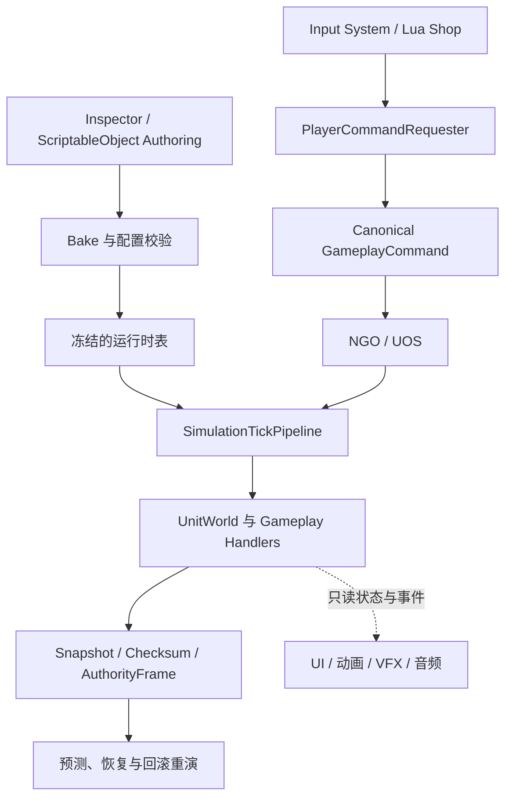
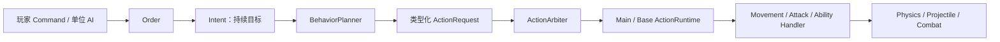
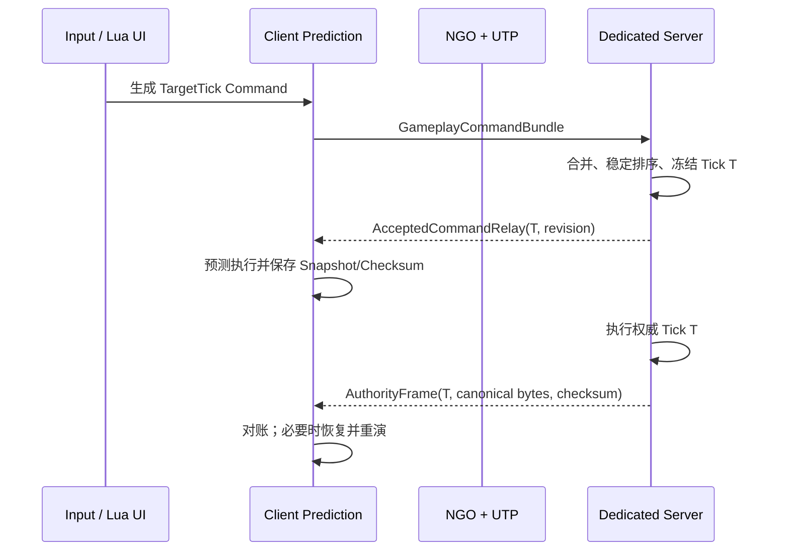
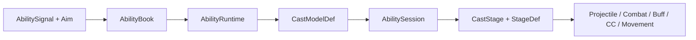
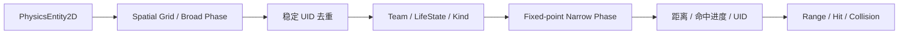
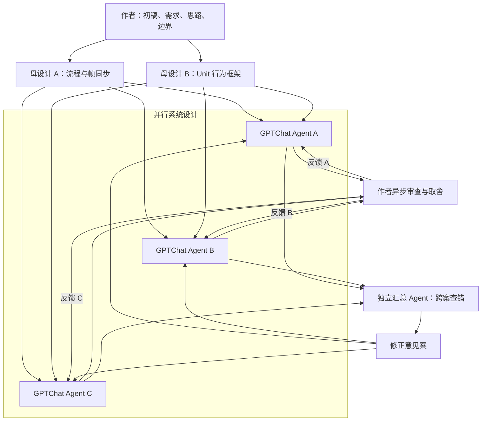
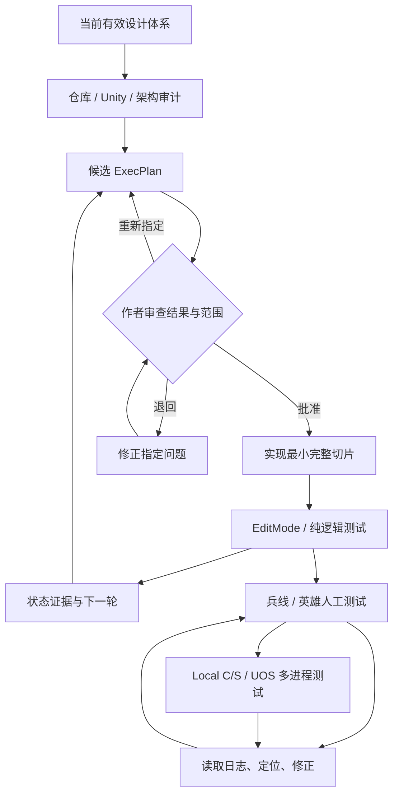
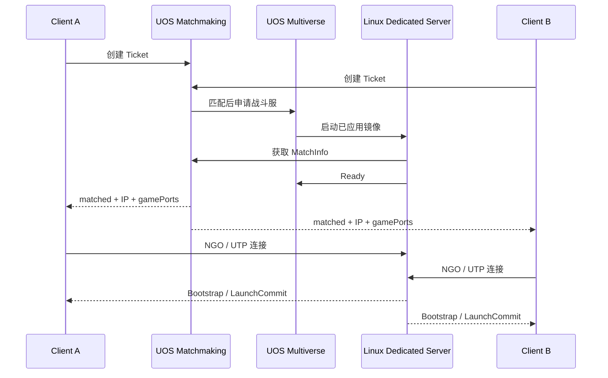

# FrameSyncMobaDemo

一个由作者与 AI 深度协作设计、实现和验证，以 **确定性帧同步 MOBA** 为目标的 Unity 2022.3 LTS 技术演示工程。它将固定 Tick 的 Gameplay 模拟、客户端预测与回滚、Dedicated Server、NGO/UOS 对局流程，以及数据驱动的英雄、单位和战斗框架组合在同一项目中。

> 项目定位是可运行、可验证的技术框架与内容垂直切片，不是可直接发布的完整商业游戏。本文根据 2026-08-24 的源码和当前工程状态整理；正式实现依据始终以 [设计索引](Docs/Architecture/DESIGN_INDEX.md) 为准。

## 演示

- [UOS 公网双客户端实机演示：Client A](https://www.bilibili.com/video/BV1KwgF6MEYD/)
- [UOS 公网双客户端实机演示：Client B](https://www.bilibili.com/video/BV1KwgF6MEGa/)

视频对应历史已验收包。D-045、D-047、D-048 的源码与定向验证已完成，但匹配这些协议和资源拆分变更的新版 Windows Client 与 Linux Dedicated Server 实机重建验收仍待执行，因此旧视频不是新版包的验收结论。

## 这个项目做了什么

- 固定 Tick 的确定性 Gameplay：固定点数、稳定 UID、显式排序、确定性随机与规范化字节序列化。
- 帧同步链路：Canonical Command、服务端 AuthorityFrame、客户端预测、逐 Tick Checksum、Snapshot/Restore/Resolve/Rebuild、回滚重演与缺帧恢复。
- 应用流骨架：Client/Server Bootstrap、Local NGO、UOS Matchmaking/Multiverse、选人、加载、对局、死亡与复活边界。
- 数据驱动 Gameplay：Unit、移动、普攻、技能、Buff、控制、Projectile、Combat、装备、商店、金币、小兵、防御塔和 AI 共用确定性规则。
- 逻辑空间与路径：二维固定点物理、稳定范围查询、Direct/A*、队伍流场、确定性 RVO 与投掷物扫掠命中。
- 客户端表现：Animator 状态投影、技能指示器、VFX/SFX、相机、鼠标悬停描边和 Lua 驱动的 HUD/商店页面。表现层只读取 Gameplay，不能反写权威状态。
- 客户端资源边界：使用 63 个本地 Addressable 根；8 个 Unit、8 个 Projectile 和地图均拆为同步加载的正式逻辑 Prefab 与异步客户端 View。Dedicated Server 排除客户端内容、Addressables catalog 和 bundle。

当前内容切片包括韦鲁斯、亚托克斯、两方近战/远程小兵和防御塔。正式装备目录已包含 Dagger、Amplifying Tome、Pickaxe、Recurve Bow、Guinsoo's Rageblade，以及 Sundered Sky 和它的组件链等 11 件装备。

## 架构概览



程序集依赖保持单向：

```text
Deterministic   Physics   RuntimeConfig
       \          |          /
                    Unit
                     |
                 FrameSync
                     |
                 PlayerInput
                     |
            LuaBridge / Bootstrap
```

`Bootstrap` 承担场景、Unity 调度、NGO/UOS 与 UI 组合；确定性 Gameplay 不依赖设备输入、传输实现或表现层。客户端 View 位于单独的 `FrameSyncMoba.ClientContent` 程序集，并通过 `!UNITY_SERVER` 从 Dedicated Server 构建中排除。

## 核心系统架构

### Unit：所有单位共用的行为内核

`Unit` 是身份、阵营、生命周期和 Gameplay 能力的聚合根，不是承载全部英雄规则的巨型脚本。英雄、小兵和防御塔通过不同的 `UnitPrototype`、`HandlerLoadout` 和数据资产组合能力，但共用同一条行为链：



这条链把“想做什么”“下一步申请什么”“当前能否开始”和“开始后如何推进”分开。D-047 之后，`Planner` 只提出请求，`ActionArbiter` 是普通动作唯一的开始、打断和资源仲裁边界，`ActionRuntimeSet` 固定拥有一个 Main 槽和一个 Base 槽：

- 普攻前摇和普通施法通常占用 Main；路径移动与技能 Dash 使用 Base。
- 亚托克斯 Q 可以保持 Main 施法和锁定朝向，同时由 E 在 Base 执行位移。
- 韦鲁斯 Q 蓄力可以与路径移动共存，释放阶段再按配置回收 Facing 并取消冲突移动。
- 连续施法等待窗口保留 `AbilitySession`，但释放 Main；纯 Toggle 技能不占用 Main/Base Runtime。
- 恐惧、魅惑、嘲讽等强制行为仍经过 Planner/Arbiter；击飞、击退和拉回属于空间覆盖，由控制系统仲裁后交给移动系统。

`UnitWorld` 统一拥有稳定 `UnitUid` 注册、出生、销毁和 `Alive → Dying → Dead → Respawning` 生命周期。`MovementHandler`、`AttackHandler`、`AbilityHandler`、`BuffHandler`、`CrowdControlHandler`、`EquipmentHandler` 与 `StatHandler` 各自拥有自己创建的 Runtime 和 Handle；死亡与复活不会用“一键清空”破坏跨死亡被动或装备状态。

游戏内 AI 也遵守相同边界。小兵和防御塔控制器读取正式 Attack/Ability 定义，产生已有的 Order、ActionRequest 和 `AbilitySignal`；它们不模拟键鼠、不调用玩家输入模块，也不创建玩家网络 Command。影响 Gameplay 的 AI 集合始终按稳定 UID 推进。

### FrameSync：Command、权威帧与回滚恢复

项目采用 Dedicated Server 权威、客户端预测的确定性帧同步。网络同步的是输入及其验证结果，而不是每帧持续同步所有单位的位置、血量和 Buff：



Command 按 `TargetTick → PlayerSlot → ControlledUnitUid → CommandSeq` 形成稳定顺序，并以完整 Canonical Command Bytes 参与权威比较。`AcceptedCommandRelay` 提前提供某 Tick 当前接受的完整命令集合；最终 `AuthorityFrame` 携带 Tick、revision、规范命令字节、Flags 和 `SharedGameplayChecksum`。客户端必须同时比较输入字节和 Gameplay 结果，不能只比较“命令看起来一样”。

客户端区分三个进度：服务端下一执行 Tick、连续接受的最新 AuthorityFrame Tick，以及客户端下一预测 Tick。预测受 `MaxPredictionLeadTicks` 限制；权威帧必须连续接受，若中间缺 Tick，客户端停止扩大预测但继续收包，并通过缺帧范围请求恢复。收到较新的帧并不能跳过中间缺口。

每完成 Tick `T` 就保存 `SnapshotTick = T + 1`。恢复严格分为：

1. `Restore`：写回纯值、数组、固定槽和稳定 ID。
2. `Resolve`：把 `UnitUid`、`ProjectileUid` 等引用解析到恢复后的运行对象；无效引用必须显式失败。
3. `Rebuild`：重建空间网格、缓存和运行时接缝，不能借机修改权威状态。

客户端从合法快照恢复后，用 AuthorityFrame 的命令重演到原预测末端。如果权威重演后校验仍不一致，就视为确定性故障并记录诊断，而不是把真实分叉伪装成普通网络误差。当前 `GameplaySnapshot.CurrentSchemaVersion` 为 23，包含固定 Main/Base ActionRuntime 槽；Bootstrap wire 为 v4，混用旧端点会在协议入口显式失败。

### 时间与启动：毫秒 Authoring，Tick Runtime

项目把现实时间配置和确定性运行状态分开。Inspector 中表示持续时间、前摇、冷却或流程等待的内容使用整数毫秒，并在 Bake 时按明确的 `Ceil`、`Nearest` 或 `Floor` 策略转换为 Tick。运行时、Command、Snapshot、Checksum 和 AuthorityFrame 仍只保存整数 Tick。

当前 `GlobalGameplayData` 配置为 50 Tick/s；工具支持 10～120 Tick/s 且必须为 5 的倍数。网络等待、加载进度、Ping 和 Unity 调度使用整数毫秒与单调时钟，本机 UTC 只允许用于日志和构建产物命名。

开局采用显式两阶段屏障：

```text
SceneLoaded
→ 服务端广播 Bootstrap
→ 客户端 Restore / Resolve / Rebuild 并完成本地绑定
→ BootstrapApplied
→ 服务端等待所有客户端确认
→ LaunchCommit
→ 各端开始 Tick
```

`LaunchCommit` 使用 NGO 同步服务器时间域的 `LaunchServerTimeMilliseconds` 越过启动阈值，随后各端以本地单调毫秒锚点推进。晚到客户端只能依据真实连续收到的 AuthorityFrame 积压做受控追赶，不能根据日历时间差凭空推导几十秒 Gameplay。

### Combat：强类型请求、结算顺序与正式死亡

Attack、Ability、Buff、Equipment 和 Projectile 不直接散写生命值，而是提交 `ShieldRequest`、`DamageRequest`、`HealRequest`。三条队列共享 `SequenceInTick`，结算器比较队首以保留跨类型请求的全局顺序。

```mermaid
flowchart LR
    Sources[Attack / Ability / Buff / Equipment / Projectile] --> Queues[Shield / Damage / Heal]
    Queues --> Context[Payload + Context + Recipe]
    Context --> Mods[Outgoing / Incoming Modifiers]
    Mods --> Formula[固定 Formula Slots]
    Formula --> Apply[Shield / Resistance / Health]
    Apply --> Result[强类型 Result + EventBus]
    Result --> Pending[PendingDying / Contribution Log]
    Pending --> Lifecycle[Formal Death / Respawn]
    Lifecycle --> Reward[Statistics / Gold]
```



Combat 只按 Domain、Scope、Match、FormulaSlot 和 Operation 收集 Modifier，不接管 Buff 或装备效果的层数、冷却和生命周期。生命第一次归零只建立 `PendingDyingRecord`；同 Tick 后续治疗仍可能救回单位。三条队列清空后，Combat 才通过 `UnitWorld` 请求正式 Dying/Death。由 `UnitDeath`/`UnitKill` 反应产生的新战斗请求进入下一 Tick 的延迟缓冲，避免死亡回调递归改变当前 Tick 顺序。

击杀与助攻使用每受害者的 `CombatContributionEventLog`。事件按 `LogicTick → SequenceInTick` 排序；击杀者是最后一位造成伤害的敌方英雄，助攻者是窗口内其他有效伤害贡献英雄并按 `UnitUid` 稳定排列。英雄基础奖励为 300，小兵当前奖励为近战 21、远程 14，整数余数以稳定顺序分配。

### Ability、Attack 与 Projectile

输入层和 AI 最终只向技能系统提交 `Focus`、`Commit`、`Cancel` 三种 Gameplay 动词，以及单位、点或方向组成的 `AimSnapshot`。`CastModelDef` 负责信号和阶段状态机，`StageDef` 负责该阶段实际产生的伤害、投掷物、Buff、控制或位移：



普通确认施法、蓄力释放、持续引导、Toggle 和连续多段施法由少量通用 CastModel 覆盖，具体英雄机制通过数据和可复用 Stage/Effect 扩展，不在框架核心中写英雄名分支。

普通攻击由 `AttackHandler` 管理目标、前摇、Commit、后摇、取消和攻击重置。近战 Commit 可直接提交 Combat，远程 Commit 创建 Projectile。强化普攻在攻击开始时锁定到 `AttackSession` 快照，飞行过程中 Buff 或被动状态变化不会改写这次攻击的判定。

Projectile 是独立确定性运行对象，拥有稳定 UID、运动、生命周期、目标过滤、命中记忆和效果发射。其每 Tick 顺序为 `CommitSpawns → AdvanceMotion → UpdateLifecycle → ResolveHits → EmitEffects → FlushDestroy`；命中候选按运动进度和目标 UID 排序，再决定穿透、最大命中数以及向 Combat/Buff/CC 发出什么正式请求。

### Buff 与 Crowd Control

同一单位、同一 `BuffConfigId` 最多存在一个 `BuffRuntime`。`BuffDefinition` 保存静态 Effect/Reaction，Runtime 只保存来源、层数、持续时间和定长 Blackboard。哪个 Effect 创建 Stat/Combat Modifier Handle 或外部 Projectile，哪个 Effect 就把 Handle/UID 写入自己的 Blackboard 槽，并负责更新、死亡清理、复活重建和最终移除。

Crowd Control 把配置 Bake 成紧凑模块操作表，而不是通过一个按控制类型扩张的巨型 switch。每次 Add 都创建独立实例；汇总视图对动作限制和标签做 OR，对减速取最大、视野比例取最小，强制行为按 `Priority → StartTick → InstanceId` 选稳定胜者。控制免疫、净化和不可阻挡是三个不同机制；强制位移由控制系统选出唯一结果，再由 Movement 执行确定性轨迹。

### Equipment、Shop 与 Gold

装备静态配置分为 `EquipmentDefinition → EquipmentEffectDef → EquipmentEffectModule`：Definition 管身份、价格、属性、标签和配方；EffectDef 表达完整主动或被动效果；Module 表达事件触发、Tick、动态属性或 CombatModifier。六格装备栏保存实例、层数、充能、冷却和效果 Runtime。

商店直接枚举同一个 `GlobalGameplayData.EquipmentDatabase`，没有第二份商品表。购买 Command 只表达玩家与目标装备；所有端在目标 Tick 根据同一背包、配方和低槽位优先规则计算 `EquipmentPurchasePlan`。动态价格扣除本次确定性选中的组件价值，购买、出售和撤销都记录在 `EquipmentShopRuntime.OperationLog` 中。

```text
补刀 / 击杀 / 助攻 / 自然收入 / 地图奖励
    → GoldIncomeRuntime
    → 每 Tick Batch + Digest
    → AuthorityFrame 连续确认后成为 ConfirmedEarnedGoldTotal

购买 / 出售 / 撤销
    → EquipmentShopRuntime.OperationLog
    → EffectiveShopGoldDelta

CurrentAvailableGold
    = ConfirmedEarnedGoldTotal + EffectiveShopGoldDelta
```

`CurrentAvailableGold` 是只读派生值。UI 的本地 `RequestCheck` 只用于及时反馈，目标 Tick 上所有端仍执行同一正式可行性检查。Guinsoo's Rageblade 的 On-Hit、Seething Strike 层数与满层每第三次重复效果，以及 Sundered Sky 的强化攻击、冷却和溢出治疗护盾链，都通过通用装备模块组合完成。

### 固定点二维物理与寻路

Unity Physics 不作为 Gameplay 权威。`PhysicsEntity2D` 是逻辑位置、上一位置、朝向、形状和 AABB 的唯一拥有者，支持 Point、Circle、Segment 和 Rect。空间查询遵循“收集候选 → UID 去重 → 业务过滤 → 精确相交 → 稳定排序 → 截取结果”，不能因网格桶遍历顺序提前结束。



移动前的 `RvoGrid` 供邻居避障读取；移动、强制位移和墙体修正后的 `UnitFinalGrid` 供碰撞、范围查询和 Projectile 命中。二者都是可重建索引，不进入完整 Snapshot。逻辑姿态只从 `PhysicsEntity2D` 单向投影到 Transform，动画、击飞高度、镜头平滑和受击抖动不能反写逻辑位置。

`RouteResolver` 按用途选择 Direct、A* 或队伍流场。A* 使用固定的 `F → H → NodeIndex` 比较、Octile Distance 和禁止斜穿墙规则；队伍流场保证 `NextCell` 指向更低成本邻居；确定性 RVO 先为所有单位计算同一时间切片的期望速度，再按 UID 排序的邻居和固定候选速度集统一求解，消除先后移动顺序造成的分叉。

### Lua/UI、输入与表现层

`PlayerInputController` 只在本地读取 Input System。输入事件进入 `LocalInputEventBuffer` 后，由 `PlayerCommandRequester` 根据每个技能的 `CastModelDef`、`AimKind` 和输入模板转换为规范 Command。Shop、QWER、移动、攻击和技能加点共享同一个 Requester 与 CommandSeq 所有者；回滚和重演不会重新读取设备。

UI 使用 xLua。`LuaManager` 维护唯一 `LuaEnv`，页面模块通过 `module.New(refs)` 创建独立实例；C# 侧的 `LuaHost`、`UIManager`、`UIList` 和 `UICell` 管理生命周期与复用。Lua 可以读取静态数据库、Unit/Handler 只读视图和 Shop 接口，也可以提交类型化请求，但不能直接修改技能 Runtime、Stat、装备槽、金币或 Command Buffer。

Animator、VFX、音频、技能指示器、相机、鼠标高亮和 UI 只消费只读 Gameplay 状态或带稳定 `PresentationEventId` 的事件。回滚重演通过客户端事件账本避免重复播放。表现对象即使异步加载失败、丢失或重建，也不能改变命中、控制持续时间、逻辑位置或 Checksum。

### 本地 Addressables 与 Dedicated Server 资源边界

`GlobalPrefabTable` 仍是唯一 `PrefabKind + PrefabId` 注册表。每个条目保存同步逻辑 Prefab，并可附带一个稳定客户端 View 地址：

```text
GlobalPrefabTable
  PrefabId -> logicPrefab + optional clientViewAddress
                    |                    |
                    v                    v
      UnitWorld / ProjectileWorld   ClientContent loader
          synchronous logic          asynchronous view
                    \                 /
                     stable UID binding
```

客户端逻辑对象先同步创建，View 随后按稳定 UID 和对象身份异步绑定。回滚若用同一 UID 创建了新对象，Binder 会识别对象身份变化并重新绑定；每个 Addressables 句柄由引用计数 Lease 明确拥有和释放，取消代次阻止过期异步结果在场景清理后回写。

当前六个本地组如下：

| Group | 用途 | 根数量 |
|---|---|---:|
| `Client-UnitViews` | 8 个 Unit View Prefab | 8 |
| `Client-ProjectileViews` | 8 个 Projectile View Prefab | 8 |
| `Client-VFX` | 独立生成的表现效果 | 7 |
| `Client-Audio` | 正式音频根 | 1 |
| `Client-Shared` | 地图与共享客户端根 | 4 |
| `Client-UI` | 页面、指示器和独立图标 | 35 |

Catalog 和 bundle 都是随客户端安装的本地内容；没有远程 catalog、CDN、运行时下载或热更新路径。Dedicated Server 不初始化 Addressables，构建前剥离客户端场景对象，过滤遗留 `StreamingAssets/aa`，并在 BuildReport 中审计模型、动画、材质、VFX、音频与 UI 依赖。平台构建守卫还会检查 Windows 包是否误带 Linux bundle，避免再次出现 Shader 全部变紫的问题。

## 研发与 AI 协作

项目的设计、实现和验证过程都有 AI 深度参与，但 AI 不参与游戏运行时决策；小兵、防御塔和单位 AI 都是确定性 Gameplay 系统。

### 设计阶段

作者提供需求、边界与审查结论；GPTChat 协助演进系统设计。设计以帧同步流程和 Unit 行为框架两份母设计为基础，多份系统设计在并行审查与交叉校验中逐步收敛。当前唯一有效的设计版本由 [DESIGN_INDEX.md](Docs/Architecture/DESIGN_INDEX.md) 指定，跨系统冻结决策记录在 [DECISION_LOG.md](Docs/Architecture/DECISION_LOG.md)。

设计阶段不是让一个 Agent 从头到尾独立输出。作者把初稿、实现思路和不可突破的边界分别交给多个设计 Agent；任何一份文档完成一轮后都会立即进入作者审查，其他文档仍并行推进。复杂系统会经历多轮退回、补充和重新对齐：



阶段末期再由独立汇总 Agent 跨文档检查同名异义、所有权冲突、Tick 顺序、Snapshot 边界和程序集依赖；修正意见返回原设计继续迭代。这个过程形成的当前版本才进入正式设计索引，旧版本和审计材料保留作历史证据。

### 框架编码阶段：候选计划驱动

早期框架建设从 [0000 仓库审计计划](Docs/Implementation/Plans/0000_repository_audit_and_framework_planning_execplan.md) 开始。`0000` 不直接写玩法，而是审计仓库、Unity、程序集依赖、设计权威、缺失契约和验证基线。Codex 在完成一个基础设施切片后提出后续候选 ExecPlan，作者同时审查上一计划的结果与下一计划的范围，决定批准、退回或重新指定。这个阶段的候选计划、已完成计划和审计记录保存在 [Docs/Implementation/Plans/](Docs/Implementation/Plans/)，它们是理解框架如何逐步落地的重要工程历史。

### 当前具体实现阶段：需求与设计案直接驱动

现在以作者给出的具体需求和当前正式设计案为主进行实现：先解析设计权威和现有实现，再选择最小完整切片、完成 Unity 编译与聚焦测试，并记录当前证据。候选计划不再自动生成或替代作者的需求；仍有意义的高风险或跨模块工作会按约定建立正式 ExecPlan。完整执行约定见 [AI 直接请求工作流](Docs/Implementation/AI_WORKFLOW.md)。

框架建设阶段的典型闭环如下，历史候选计划在这里承担的是“把庞大框架拆成可审查、可验证切片”的作用：



### Unity MCP：把文本修改闭合到真实 Unity 工程

项目使用 [IvanMurzak/Unity-MCP](https://github.com/IvanMurzak/Unity-MCP) 让 Codex 操作 Unity Editor。它是研发工具，不会进入发布后的客户端或服务器。主要用于：

- 检查 Scene、Prefab、ScriptableObject、Animator、Addressables 和序列化引用；
- 触发 AssetDatabase 刷新和真实 Unity 脚本编译，读取 Console；
- 运行 EditMode/PlayMode 测试并读取 Test Runner 结果；
- 调用项目 Editor 工具、截取 Game/Scene View、采集 Profiler 数据；
- 通过 Unity API 创建或修改不能安全手写 YAML 的资产。

因此工程闭环是“需求/设计 → 代码和资产 → Unity 导入/编译 → 自动测试 → 人工多进程验收 → 日志修正”，而不是只修改源码后假设 Unity 可以运行。

## 当前内容垂直切片

### 韦鲁斯

- 蓄力 Q：按下进入 Hold，期间仍可移动；本地指示器读取当前形态，确认后发射确定性 Projectile。
- W：Toggle 不占 Main/Base Runtime；枯萎层数、On-Hit 与后续技能引爆走正式 Buff/Combat 链。
- E：区域 Projectile 与持续效果；R：投掷物命中、腐败藤蔓传播和原始施法者归属。
- 被动、普攻投掷物、冷却、技能加点、HUD 和 HeroTest 输入均接入通用框架。

### 亚托克斯

- 被动强化普攻在攻击开始时锁定，伤害、治疗和冷却缩减读取同一确定性攻击快照。
- Q1/Q2/Q3 使用三段连续施法、不同几何区域与剑锋判定；Q 影响阶段可与 E 的 Base Dash 共存。
- W 由首段 Projectile、英雄限定束缚、可快照的静止区域 Projectile、逃脱/完成结算和拉回组成。
- E 包含 Dash、攻击计时重置与被动全能吸血；R 包含非英雄恐惧、可刷新/衰减属性 Buff、幽灵状态和参与击杀延长。
- 通用 Animator Profile 投影被动就绪、World Ender、三段 Q 和 W 阶段；翅膀、Gizmo、指示器与 VFX 都属于客户端表现。

### 小兵、防御塔与地图

- 地图逻辑 Prefab 保存确定性拓扑、三条兵线、障碍和六份队伍/体型流场；客户端 MapView 单独异步加载并锚定世界原点。
- 两队各有近战/远程小兵逻辑 Prefab 和 View，波次按稳定子类型顺序生成并读取正式 FlowField。
- 小兵内建 Buff 数据化实现对小兵/防御塔的伤害规则；防御塔拥有英雄攻击递增和飞行中 Projectile 锁定快照。
- 防御塔目标红线、模型、Animator 与死亡动画纯属客户端表现；塔的索敌、攻击和伤害结算仍在 Gameplay。
- `MinionTowerLongRunTest`、正式 Map Prefab 测试和路径/流场测试覆盖当前可运行兵线夹具；完整野区内容仍未闭合。

### 装备、商店与 HUD

- 正式装备目录包含 11 件资产：Dagger、Amplifying Tome、Pickaxe、Recurve Bow、Guinsoo's Rageblade、Long Sword、Ruby Crystal、Glowing Mote、Tunneler、Caulfield's Warhammer 和 Sundered Sky。
- 六格背包支持组件消耗、动态合成价格、Basic/Advanced 重复规则、Finished 重复拒绝、购买、出售和严格 LIFO 撤销。
- Guinsoo's Rageblade 与 Sundered Sky 是两个完整装备效果垂直切片，验证 On-Hit、层数、冷却、最大生命值相关效果与溢出治疗护盾。
- Shop 和 HUD 读取同一个正式 EquipmentDatabase、PlayerSlot→Unit 映射和 `CurrentAvailableGold`；Lua 不维护第二份商品或金币状态。
- HUD 已覆盖生命/法力、属性、技能冷却、Buff 栏、KDA/补刀、Ping、队伍比分和六格装备视图；生产级技能图标、技能升级根和 Buff Tooltip 仍有缺口。

### UOS 在线对局链路



UOS 负责匹配、分配和 Linux 战斗服托管，不替代项目自身的 NGO/UTP 帧同步协议。本地 C/S 与 UOS 使用同一 Gameplay、Bootstrap、Command 和 AuthorityFrame 实现。历史包已完成过 Ready、双客户端连接和持续 Gameplay；当前 schema-23/bootstrap-wire-4 与 Addressables 拆分后的匹配重建包仍待新的实机验收。

## 工程导航

| 位置 | 内容 |
|---|---|
| `Assets/Scripts/Deterministic/` | Tick、固定点基础值、稳定随机与规范化写入器 |
| `Assets/Scripts/Physics/` | 逻辑物理、形状、空间网格、范围与碰撞查询 |
| `Assets/Scripts/Gameplay/` | UnitWorld、Handler、战斗、技能、Buff、装备、Projectile、AI 与路径 |
| `Assets/Scripts/FrameSync/` | Command、Tick 管线、快照、校验、预测、回滚与权威恢复 |
| `Assets/Scripts/PlayerInput/` | 一次性将设备输入转换为 Gameplay Command |
| `Assets/Scripts/RuntimeConfig/` | 全局配置、Prefab 表、时间 Authoring 与 Bake/校验工具 |
| `Assets/Scripts/Bootstrap/` | 场景、Local NGO、UOS、应用流与组合根 |
| `Assets/Scripts/ClientContent/` | Addressables 加载、Unit/Projectile/地图客户端 View 绑定 |
| `Assets/Scripts/LuaBridge/`、`Assets/StreamingAssets/Lua/` | xLua UI 生命周期和只读 Gameplay 视图 |
| `Assets/Config/Formal/` | 当前正式逻辑配置与 Prefab |
| `Assets/ClientContent/` | 客户端模型、动画、材质、VFX、音频、UI 等表现资产 |
| `Assets/Scenes/` | ClientBootstrap、ServerBootstrap、Lobby、GameScene 及测试场景 |
| `Docs/` | 当前设计、实现状态、测试、构建说明和历史计划 |

常用场景包括 `ClientBootstrap`、`ServerBootstrap`、`Lobby`、`GameScene`，以及用于内容和表现验证的 `HeroTestScene`、`MinionTowerLongRunTest`、`CameraDebugScene`。

## 环境与打开工程

- Unity：`2022.3.62f1c1`
- 当前正式运行配置：50 Tick/s；Authoring 工具支持 10～120 Tick/s（5 的倍数）
- 渲染管线：URP 14
- 输入：Unity Input System 1.14.2
- 网络：Netcode for GameObjects 1.12.2、Unity Transport、UOS SDK
- 资源：Addressables 1.22.3
- UI：xLua、TextMeshPro、UGUI
- 固定点：`Unity.Mathematics.FixedPoint.fp/fp2`

请使用上述 Unity 版本打开工程，让 Unity 根据 `Packages/manifest.json` 还原依赖。不要手工编辑 Scene、Prefab、InputAction 或 ScriptableObject 的 YAML；应通过 Unity Editor 修改其序列化引用。

## 运行、打包与测试

本项目提供 Windows 客户端与 Linux Dedicated Server 的构建入口。具体前置条件、输出目录、Addressables 平台审计、UOS 打包与安全注意事项请阅读：

- [构建指南](Docs/Implementation/BUILD_GUIDE.md)
- [本地 C/S 测试指南](Docs/Implementation/C_S_TEST_GUIDE.md)
- [完整对局测试计划](Docs/Implementation/TEST_PLAN.md)
- [UOS 客户端启动器指南](Docs/Implementation/UOS_CLIENT_LAUNCHER_GUIDE.md)

Unity 菜单中的本地构建入口为 `FrameSyncMoba/Build Local NGO/Build Both`。构建操作一次只能发起一轮；构建期间不要继续对同一工程执行 Unity 操作，等待构建完成后再检查报告和日志。

### 本地 C/S

本地拓扑是一个 Windows Dedicated Server 加两个独立 Windows Client。构建输出为：

```text
Builds/LocalNgo/Server/FrameSyncMobaServer.exe
Builds/LocalNgo/Client/FrameSyncMobaClient.exe
```

启动时先运行 Server；两个客户端必须分别携带 `--LocalPlayerSlot=0` 和 `--LocalPlayerSlot=1`。三个进程都应通过 `-logFile` 写入不同日志，避免客户端共用默认 `Player.log`。完整启动命令、操作检查表和错误标记见 [本地 C/S 测试指南](Docs/Implementation/C_S_TEST_GUIDE.md)。

### UOS Client 与 Linux Dedicated Server

UOS 组合构建入口为：

```text
FrameSyncMoba/Build Local NGO/Build Client + Server (UOS, Once)
```

它依次构建 Windows UOS Client 与 Linux Dedicated Server，并在服务器 BuildReport 成功后生成 ZIP 和 SHA-256：

```text
Builds/UosUpload/FrameSyncMobaServer_uos_<timestamp>.zip
Builds/UosUpload/FrameSyncMobaServer_uos_<timestamp>.zip.sha256
```

Linux 镜像入口为 `./FrameSyncMobaServer.x86_64 -batchmode -nographics`，游戏端口使用 UDP 7777。UOS 的应用权限、Matchmaking Config、Multiverse Profile 和账户信息由运行环境提供，不应把 Secret、allocation UUID 或临时房间信息写入仓库。

构建菜单会显式切换 Windows Player 与 Linux Server 子目标，并在完成后恢复编辑器原目标。Client 内容构建会校验 `settings.json`、平台目录和 bundle；Server 构建会过滤任何新旧 Addressables 客户端输出并审计最终依赖。不要为了打 Server 手工删除客户端资源，也不要把 `Assets/ClientContent/` 加到逻辑 Prefab 或 Server 场景。

### 测试层次

测试按风险分为三层：

- EditMode/纯逻辑：稳定排序、固定点几何、序列化、Command 字节、技能阶段、Combat 结算、Buff/CC、装备、Snapshot 往返、Checksum 与回滚等。
- PlayMode：Scene、Prefab、Input System、GameObject 生命周期、Animator、Addressables、相机、鼠标检测、UI 和表现绑定。
- 多进程人工验收：一个 Dedicated Server 与两个客户端的 Local NGO/UOS 完整链路，覆盖加载、统一开局、移动、攻击、QWER、商店、死亡复活和长时间 Checksum 稳定性。

确定性功能的测试会在适用时同时覆盖重复执行等价、连续执行与 Snapshot/Restore/Replay 等价、插入顺序无关，以及无效配置的稳定失败。

## 当前验证状态

最近记录的验证基线如下：

| 验证 | 结果 |
|---|---|
| Unity 编译 | 2026-08-23 普通 Player 与 Linux Dedicated Server 子目标通过；Server Player 程序集不包含 `FrameSyncMoba.ClientContent` |
| Bootstrap EditMode | 106/106 通过 |
| FrameSync EditMode | 91/91 通过 |
| Addressables 配置 | 本地组/根 5/5；Server 遗留 StreamingAssets 排除 1/1 |
| Addressables/表现 PlayMode | 代表性真实根加载释放、UI 异步生命周期、Aatrox Prefab、MapView 锚点、HeroTest Shop/Input 等定向测试通过 |
| PlayerInput | 映射 17/17；聚焦 PlayMode 输入模拟 4/4 |
| 完整 PlayMode 基线 | 56/60 通过，4 项保留失败 |

当前 Addressables 构建证据记录了 63 个根、零远程条目、7 个 bundle 加 1 个 catalog。已记录的一轮本地内容输出约 612 MB，其中三个大型 Projectile GLB 是主要体积来源；这属于模型/导入优化问题，不应通过重复地址或破坏逻辑/View 边界解决。

这不是“完整测试套件全绿”的声明：当前 Unit 套件仍保留 10 项已知失败；最近一次完整 PlayMode 结果为 56/60 通过，保留 4 项失败。具体类别、证据与限制见 [模块状态](Docs/Implementation/MODULE_STATUS.md) 和 [当前交接状态](Docs/Implementation/CURRENT_HANDOFF.md)。

## 已知限制与待验收项

- D-048 的源码、资产拆分和定向测试已完成；最终 Windows Client + Linux Dedicated Server Player 重建、平台资源审计和报告检查仍待执行。
- D-045/D-047 已提高 Snapshot schema 与 bootstrap wire 版本，所有端点必须使用同一轮重建包；新版 Local C/S 与 UOS 实机验收尚未完成。
- UOS 仍需针对启动时 UTP 发送队列告警与回调所有权完成新的行为证据和实机复测。
- 丛林内容、部分生产级 HUD/表现资产、结果/返回大厅/远端结算的端到端验收仍未完成。
- `EquipmentTargetPolicy` 的正式设计尚未定义完整取值和匹配语义，因此装备主动目标/距离仲裁只实现了可由当前设计证明的部分。
- `UIManager` 当前初始化时仍会加载全部 7 个页面 Prefab，即使页面未配置为预实例化；按需懒加载属于后续客户端内存优化。
- 客户端表现资产和新 Loader 程序集已从 Server 排除，但部分旧表现类仍在共享程序集；完整表现代码 asmdef 拆分是独立的大型重构。
- 仓库没有单独的开源许可证文件；复用源码或资源前需要先向仓库所有者确认授权。

## 设计案与模块对应关系

正式实现只使用 [DESIGN_INDEX.md](Docs/Architecture/DESIGN_INDEX.md) 标记为 Current 的版本；文件名较旧、已完成计划或归档报告都不能自行提升为当前需求。

| 模块/系统 | 当前正式设计 |
|---|---|
| 帧同步、流程、权威帧、恢复、比赛规则 | [FrameSync Flow v10.2](Docs/Design/FrameSync_Flow_Integrated_System_Design_v10_2.md) + D-045 |
| Snapshot 精确成员与三阶段恢复 | [Snapshot Appendix v7.2](Docs/Design/FrameSync_Snapshot_Contents_Appendix_v7_2.md) + Unit v27.4 amendment section 6 |
| Unit、Handler、行为 AI、生命周期和动作仲裁 | [Unit Framework v27.3](Docs/Design/unit_behavior_framework_design_v27_3.md) + [v27.4 amendment](Docs/Design/unit_behavior_framework_design_v27_4_action_arbitration_amendment.md) |
| 战斗、正式死亡、贡献与奖励 | [Combat v13.2](Docs/Design/moba_combat_system_design_v13_2.md) |
| Projectile | [Projectile v19](Docs/Design/MOBA_FrameSync_Unity_Projectile_System_Design_v19.md) |
| Ability、CastModel、Stage 与被动 | [Ability v15.2](Docs/Design/moba_ability_system_design_v15_2.md) |
| 普通攻击 | [Attack v6.2](Docs/Design/moba_attack_module_design_v6_2.md) |
| Buff | [Buff v14.2](Docs/Design/BuffSystem_Design_v14_2_PermanentBuffRespawnPatch.md) |
| Crowd Control | [Crowd Control v6.2](Docs/Design/moba_crowd_control_system_design_v6_2.md) |
| 装备、商店与金币 | [Equipment/Shop/Gold v12](Docs/Design/moba_equipment_shop_gold_system_design_v12.md) |
| 二维物理与范围查询 | [Unit Physics v13.1](Docs/Design/MOBA_UnitPhysics_RangeQuery_Design_v13.1.md) |
| Direct、A*、FlowField 与 RVO | [Pathfinding v13.1](Docs/Design/MOBA_FrameSync_Integrated_Pathfinding_Design_v13_1.md) |
| 小兵、防御塔与非英雄单位 | [Non-hero v5](Docs/Design/moba_non_hero_unit_modules_design_v5.md) |
| 动画、VFX、音频、表现回滚和客户端资源 | [Presentation v13.2](Docs/Design/moba_presentation_layer_integrated_design_v13_2_fifth_round_audio_entry.md) + D-048 |
| UI 与 Lua | [UI/Lua v9.1](Docs/Design/MOBA_UI_Lua_System_Design_v9_1_GoldIncomeRuntime_Aligned.md) |
| 玩家输入与非智能施法 | [Player Input v1.1](Docs/Design/MOBA_Player_Input_Command_Module_Design_v1_1.md) |

## 设计与工程约定

[DESIGN_INDEX.md](Docs/Architecture/DESIGN_INDEX.md) 是唯一的当前正式设计索引；当文档与实现不一致时，遵循该索引、[决策日志](Docs/Architecture/DECISION_LOG.md) 与仓库中的工程约定。历史计划和归档资料用于理解决策及实现脉络，但不自动成为新的实现要求。

权威 Gameplay 的关键约束如下：

- 不使用 `float`/`double`、`UnityEngine.Random`、`Time.deltaTime`、Unity 物理或容器枚举顺序作为 Gameplay 权威。
- Command、Snapshot、Checksum、UID、Aim、AbilitySignal 等公共协议各有唯一所有者；不要复制定义。
- Snapshot 恢复分为 Restore、Resolve、Rebuild 三阶段；无效的确定性引用必须显式失败，不能静默修复。
- 输入只在采集时转换成 Command；回滚和重演绝不重新读取设备。
- 表现可以平滑、丢失或重建，但不能改变逻辑位置、命中、控制持续时间或 Checksum。

更多入口：

- [当前模块状态](Docs/Implementation/MODULE_STATUS.md)
- [当前工程交接状态](Docs/Implementation/CURRENT_HANDOFF.md)
- [架构与程序集地图](Docs/Architecture/REPOSITORY_MAP.md)
- [资源架构](Docs/Implementation/Addressables/RESOURCE_ARCHITECTURE.md)
